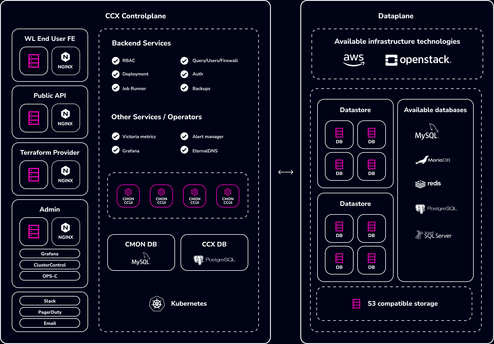

# Installation

CCX is a comprehensive data management and storage solution that offers a range of features including flexible node configurations, scalable storage options, secure networking, and robust observability tools. It supports various deployment types to cater to different scalability and redundancy needs, alongside comprehensive management functions for users, databases, nodes, and firewalls. The CCX project provides a versatile platform for efficient data handling, security, and operational management, making it suitable for a wide array of applications and workloads.

## Architecture Overview

A K8s Control plane responsible for the life-cycle of the datastores, backend databases and tools responsible for metadata such as users, datastores, and other resources.



## Kubernetes cluster

### K8s Control Plane Requirements

The control plane requires the following resources:

- 3 worker nodes
- 4vCPU Per node
- 8GB of RAM Per Node
- 60 GB of Disk (for PVCs)

### Kubernetes Cluster version

CCX requires Kubernetes Cluster Version to be >=1.22.

#### Namespace

A namespace must be configured for the CCX K8s services to operate.
example: `production`

### Helm Charts
The Helm charts are located in [https://artifacthub.io/packages/helm/severalnines/ccx](https://artifacthub.io/packages/helm/severalnines/ccx).
The source respository is located in [https://github.com/severalnines/helm-charts](https://github.com/severalnines/helm-charts). The three charts used below are:
- ccx
- ccxdeps
- observability

### Prerequisite tool sets for CCX Installation
The following prerequisites are needed:
- nginx ingress controller
- NATS
- external-dns (Please see - [DynamicDNS](Dynamic-DNS.md) and please check the supported DNS provider for external-dns [here](https://github.com/kubernetes-sigs/external-dns#status-of-providers)). If you do not find your DNS on this list, we recommend that you create a zone in e.g AWS Route 53, CloudFlare or Google Cloud DNS.
- MySQL Database, aka CMON DB, is used by the CMON container to store metadata about managed/monitored data stores. See [MySQL Operator installation guide](Mysql-Operator-Installation.md).
- PostgresSQL Database, aka CCX DB, is used to store CCX (Control Plane) metadata. See [Postgres Operator installation guide](Postgres-Operator-Installation.md).
- Prometheus compatible monitoring server. If you don't have one, please visit the [Observability installation guide](Observability.md).

This prequisite can be installed using ccxdeps. Dependencies required for CCX are created as child charts inside ccxdeps.
By default only the ingress-nginx controller and the external-dns is not enabled in ccxdeps.
you can enable by setting it to true by using below command.

```
  helm repo add s9s https://severalnines.github.io/helm-charts/
  helm repo update
  helm install ccxdeps s9s/ccxdeps --debug --set ingressController.enabled=true --set external-dns.enabled=true
```

### Cloud Requirements

#### Flavors/images for datastores

CCX requires flavors built with Ubuntu 22.04 for the datastores.
For a test/evaluation the following flavors are recommended:

- 2vCPU, 4GB RAM, 80GB Disk
- 4vCPU, 8GB RAM, 100GB Disk

Also, the easiest if there is a default login account called 'ubuntu' on the image.

#### Floating IPs / Public IPs

Create a pool of floating IPs (public IPs). Each VM requires a floating IP/public IP.

#### Disk Space

Disk space can either be ephemeral or block storage. We recommend block storage as block storage devices can be scaled.

## Methods to Easy Install/Quickstart CCX Installation

There are two methods to quick start CCX.

### Method 1:

- ##### QuickStart with AWS

  If you wish to quickly install CCX in dev environment, you can use provided `ccxdeps` helm chart to install and configure dependencies.
  By default CCX will install with the cloud vendor AWS - only thing you need to provide is cloud secrets!
  If you want to customize your installation, please see the `values.yaml` and follow the guide.

  **This is recommendend only for development environment. It is a great way to make sure you have working control plane**

  ##### Create secrets

  For a super quick start you can create a `aws` secret from your existing aws credentials file `~/.aws/credentials`.

  ```
  kubectl create secret generic aws --from-literal=AWS_ACCESS_KEY_ID=$(awk '/aws_access_key_id/{print $NF}' ~/.aws/credentials) --from-literal=AWS_SECRET_ACCESS_KEY=$(awk '/aws_secret_access_key/{print $NF}' ~/.aws/credentials)
  ```

  Otherwise you can create secrets manually or by copying a [`secrets-template.yaml`](https://github.com/severalnines/helm-ccx/blob/main/secrets-template.yaml) and putting your secrets in.
  For AWS cloud make sure to setup `aws` secret.
  For Openstack make sure to setup `mycloud-openstack` secret replacing `mycloud` with your cloud code.
  Apply secrets by running:

  ```
  kubectl apply -f secrets-template.yaml
  ```

  ##### Install CCX along with dependencies

  ```sh
  helm repo add s9s https://severalnines.github.io/helm-charts/
  helm repo update
  helm install ccxdeps s9s/ccxdeps --wait --debug
  ```
:::note
  When using NFS as volume provisioner, NFS servers map requests from unprivileged users to the 'nobody' user on the server, which may result in specific directories being owned by 'nobody'. So Container cannot modify these permissions, therefore it's necessary to enable root_squash on the NFS server to allow proper access.
:::

:::note
 Make sure to install the prerequisites in `Prerequisite tool sets for CCX Installation` for ccxdeps.
:::
##### Customize your CCX values

Have a look at `values.yaml` and create your own values file to customize your CCX instance.
The very minimal `values.yaml` could be

```yaml
sessionDomain: mycloud.com
ccxFQDN: ccx.mycloud.com
ccFQDN: cc.mycloud.com
cmon:
  license: ZHVwYQ== #YOUR CMON LICENSE SHOULD BE BASE64 ENCODED HERE
# this section is for configuring specifics of the CCX system
ccx:
  # list of k8s secrets containing cloud credentials
  cloudSecrets:
    - aws
```

For testing, you can also add entry in your `/etc/hosts` file for local resolution of `ccx.local` on your machine instead of public FQDN.

:::note
 Get in touch with our s9s representative in case of issues or clarifications.
:::

### Method 2:

- ##### Run the Installation bash script
  Clone the repo [`helm-ccx`](https://github.com/severalnines/helm-charts.git) and run the script
  `./charts/ccx/scripts/ccx-yaml-gen.sh`
  You will be prompted with user inputs. please choose the option or paste parameters carefully.
  This will install the `ccxdeps` which comes with prerequisite tool-sets for CCX Installation and generate CCX `values.yaml` file for CCX installation.
  After the values.yaml file are generated. you can review your changes and run commands in [Install CCX](#install-ccx) section.

Those are the two methods which you can do quickstart install for ccx.

### Install CCX

To install ccx, run this command

```
helm repo add s9s https://severalnines.github.io/helm-charts/
helm repo update
helm install ccx s9s/ccx --wait --debug --values values.yaml
```
:::note
Ensure to check all pods, jobs are running without any errors.
:::

:::danger
Downgrades are not supported.
::::

### Cloud Provider Configuration
To know more about the CCX Cloud Provider Configuration setup, please read [CCX Cloud Provider Configuration](Cloud-Providers.md).

### Production Environment Configs

Backups needs to be configured for:

- CMON database (See [mysql](Mysql-Operator-Installation.md))
- CCX database (See [postgres](Postgres-Operator-Installation.md))
  
:::note
   Severalnines is not responsible for backups that is lost or incorrect configuration
   #### Important Notice: Taking Persistent Volume Snapshots in Production Environment
   To ensure data integrity and availability in your production environment, it is crucial to take regular snapshots of Persistent Volume Claims (PVCs) for CMON, DB's. Configure snapshot schedule at regular intervals, based on the criticality and update frequency of your data in your cloud environment
:::

### Observability

To know more about the monitoring setup, please read [Observability](Observability.md).

### Day 2:
- [Configuration Management](/admin/Day2/Config-Management.md)
- [Lifecycle Management](/admin/Day2/Lifecycle-Management.md)
- [Upgrading the Controlplane](/admin/Day2/Upgrading-the-Control-Plane.md)

