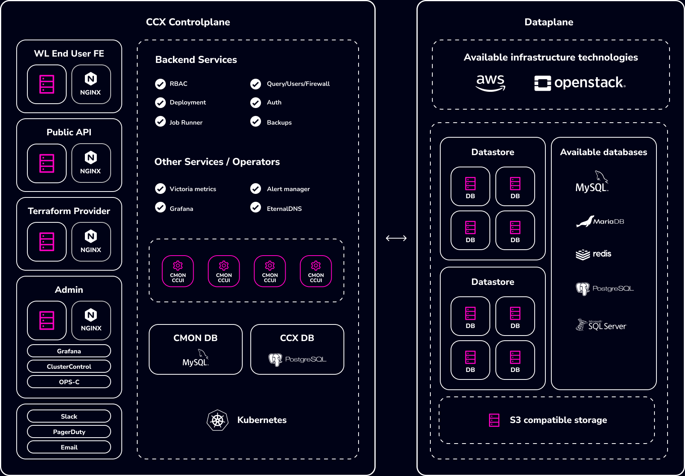

# Installation

CCX is a comprehensive data management and storage solution that offers a range of features including flexible node configurations, scalable storage options, secure networking, and robust observability tools. It supports various deployment types to cater to different scalability and redundancy needs, alongside comprehensive management functions for users, databases, nodes, and firewalls. The CCX project provides a versatile platform for efficient data handling, security, and operational management, making it suitable for a wide array of applications and workloads.

## Architecture Overview Diagram 




For a more details please read the [architecture](architecture.md).

## Quickstart

- For Openstack we recommend that you follow the [Openstack tutorial](Tutorial-openstack.md).
- For laptop/desktop installation instructions please visit [Install CCX on a Laptop](CCX-Install-Laptop.md).


### Add Severalnines Helm Chart repository

```
helm repo add s9s https://severalnines.github.io/helm-charts/
helm repo update
```

### Create the cloud credential secret

This step must come **before** installing the `ccx` chart.

:::important
`ccx.cloudSecrets` defaults to `[aws]`, and the chart refuses to render if a
secret named in that list does not already exist in the release namespace:

```
Error: execution error at (ccx/templates/cmon/stateful-set.yaml:20:19):
Missing secret defined in .Values.ccx.cloudSecrets - aws
```

Emptying the list is not a way around this — the chart then fails with
`No secrets defined in .Values.ccx.cloudSecrets`. At least one cloud credential
secret must exist before the first `helm install ccx`.
:::

To set up cloud credentials for AWS (the default provider), run the following
one-liner:

```
# Create k8s secret from AWS credentials stored in ~/.aws/credentials
kubectl create secret generic aws --from-literal=AWS_ACCESS_KEY_ID=$(awk 'tolower($0) ~ /aws_access_key_id/ {print $NF; exit}' ~/.aws/credentials) --from-literal=AWS_SECRET_ACCESS_KEY=$(awk 'tolower($0) ~ /aws_secret_access_key/ {print $NF; exit}' ~/.aws/credentials)
```

Create the secret in the same namespace you install the release into. If you
install into a `ccx` namespace, add `-n ccx` to the command above.

For any other cloud provider, create the secret for that provider and name it in
`ccx.cloudSecrets` — see [Providing cloud credentials](#providing-cloud-credentials)
below. On a CloudStack- or OpenStack-only install there is no reason to hold AWS
credentials, but the default list still names `aws`, so you must override it.

### Installation

```
# Install CCX dependencies
helm install ccxdeps s9s/ccxdeps --debug --wait
# Install CCX
helm install ccx s9s/ccx --debug --wait
```

If your cloud credential secret is not named `aws`, name it explicitly:

```
helm install ccx s9s/ccx --debug --wait --set ccx.cloudSecrets[0]=<secret-name>
```

If you do **NOT** have nginx ingress controller installed in your kubernetes cluster (very common in minikube or docker for desktop).You can install one that comes with `ccxdeps` chart like so:

```
# Install CCX dependencies
helm install ccxdeps s9s/ccxdeps --debug --wait --set ingressController.enabled=true
# Install CCX
helm install ccx s9s/ccx --debug --wait
```

Please note that this will install CCX on `ccx.localhost`.

### Configuring your CCX installation

#### Allowing datastore creation on a fresh install

By default a user must have a verified email address and an active subscription
before they can create a datastore. On a self-hosted install with no SMTP
configured, neither can be satisfied, so the deploy wizard runs to the final step
and then fails:

```
POST /api/prov/api/v2/cluster
402 Payment Required
{"err":"email verification required"}
```

Disable both checks — turning off only the first replaces this error with a
subscription one:

```yaml
ccx:
  env:
    REQUIRE_EMAIL_VERIFICATION: "false"
    REQUIRE_SUBSCRIPTION: "false"
```

See [Configuring the Helm install](Configuring-Helm-Install.md#common-configs)
for the full list of these settings.

#### Providing cloud credentials

To be able to deploy datastores to a cloud provider (AWS by default) you need to provide cloud credentials.
Cloud credentials should be created as kubernetes secrets in format specified in - https://github.com/severalnines/helm-charts/blob/main/charts/ccx/secrets-template.yaml

At least one of these secrets must exist before the first `helm install ccx` —
see [Create the cloud credential secret](#create-the-cloud-credential-secret) for
the AWS one-liner and the error you get without it.

To add credentials for a further provider, create the secret and then list every
secret name in `ccx.cloudSecrets`:

```
helm upgrade --install ccx s9s/ccx --debug --wait \
  --set ccx.cloudSecrets[0]=aws \
  --set ccx.cloudSecrets[1]=mycloud
```

Every secret named in `ccx.cloudSecrets` must exist, so create each one before
running the upgrade.


#### Setting up public access - custom domain name

Make sure that you have ingress controller in your cluster and you are able to setup externally facing load balancers and that either your domain name points to the ingress IP or you have external DNS configured in your cluster.

Simply run:

```
# Install CCX
helm install ccx s9s/ccx --debug --wait --set ccxFQDN=ccx.example.com
```

#### Further config

Please have a look at the helm values and minimal recommended values for CCX

- https://github.com/severalnines/helm-charts/blob/main/charts/ccx/minimal-values.yaml
- https://github.com/severalnines/helm-charts/blob/main/charts/ccx/values.yaml


## Kubernetes cluster

### K8s Control Plane Requirements

The control plane requires the following resources:

- 3 worker nodes
- `x86_64`/`amd64` CPU architecture on the worker nodes
- 4vCPU Per node
- 8GB of RAM Per Node
- 60 GB of Disk (for PVCs)

:::important
The CCX container images are built for `linux/amd64` only. `arm64` worker nodes
are not supported — on `arm64` the control plane runs under emulation, which is
slow and unreliable. This applies to local installs too: if you are following
[Install CCX on a laptop](CCX-Install-Laptop.md) on an Apple Silicon Mac, use an
`amd64` VM or cluster rather than the host architecture.
:::

### Kubernetes Cluster version

CCX requires Kubernetes Cluster Version to be >=1.22.

### Namespace

A namespace must be configured for the CCX K8s services to operate.
example: `ccx`

### Helm Charts

The Helm charts are located in [https://artifacthub.io/packages/helm/severalnines/ccx](https://artifacthub.io/packages/helm/severalnines/ccx).
The source respository is located in [https://github.com/severalnines/helm-charts](https://github.com/severalnines/helm-charts). The three charts used below are:

- ccx
- ccxdeps
- observability

#### Chart versions

These docs are written against **`ccx` 1.57.0** and **`ccxdeps` 0.6.22**.

The `helm install` commands throughout these docs are unpinned, so they resolve
to whatever is latest in the `s9s` repo at the time you run them. To install a
known version instead, pass `--version`:

```
helm install ccx s9s/ccx --version 1.57.0 --debug --wait
```

Release candidates are not published to the public `s9s` repo, so the newest
version available there normally lags the current internal release line. Run
`helm repo update` before checking, and use `helm search repo s9s/ccx --versions`
to list what is actually available to you.

### Prerequisite tool sets for CCX Installation

The following prerequisites are needed:

- nginx ingress controller
- NATS
- external-dns (Please see - [DynamicDNS](Dynamic-DNS.md) and please check the supported DNS provider for external-dns [here](https://github.com/kubernetes-sigs/external-dns#status-of-providers)). If you do not find your DNS on this list, we recommend that you create a zone in e.g AWS Route 53, CloudFlare or Google Cloud DNS.
- MySQL Database, aka CMON DB, is used by the CMON container to store metadata about managed/monitored data stores. See [MySQL Operator installation guide](Mysql-Operator-Installation.md).
- PostgresSQL Database, aka CCX DB, is used to store CCX (Control Plane) metadata. See [Postgres Operator installation guide](Postgres-Operator-Installation.md).
- Prometheus compatible monitoring server. If you don't have one, please visit the [Observability installation guide](Observability.md).

This prequisite can be installed using ccxdeps. Dependencies required for CCX are created as child charts inside ccxdeps.
By default only the ingress-nginx controller and the external-dns is not enabled in ccxdeps.

You can enable by setting it to true by using below command.

```
  helm repo add s9s https://severalnines.github.io/helm-charts/
  helm repo update
  helm install ccxdeps s9s/ccxdeps --debug --set ingressController.enabled=true --set external-dns.enabled=true
```

## Cloud Requirements

### Flavors/images for datastores

CCX requires flavors built with Ubuntu 22.04 or 24.04 for the datastores. Ubuntu 24.04 is recommended for new deployments. For a test/evaluation the following flavors are recommended:

- 2vCPU, 4GB RAM, 80GB Disk
- 4vCPU, 8GB RAM, 100GB Disk

Also, the easiest if there is a default login account called 'ubuntu' on the image.

### Floating IPs / Public IPs

Create a pool of floating IPs (public IPs). Each VM requires a floating IP/public IP.

### Disk Space

Disk space can either be ephemeral or block storage. We recommend block storage as block storage devices can be scaled.

### Cloud Provider Configuration

To know more about the CCX Cloud Provider Configuration setup, please read [CCX Cloud Provider Configuration](Cloud-Providers/Cloud-Providers.md).

### Production Environment Configs

Backups needs to be configured for:

- CMON database (See [mysql](Mysql-Operator-Installation.md))
- CCX database (See [postgres](Postgres-Operator-Installation.md))
  
:::danger
   Severalnines is not responsible for backups that is lost or incorrect configuration.
:::

:::danger
   **Important Notice: Taking Persistent Volume Snapshots in Production Environment**
   To ensure data integrity and availability in your production environment, it is crucial to take regular snapshots of Persistent Volume Claims (PVCs) for CMON, DB's. Configure snapshot schedule at regular intervals, based on the criticality and update frequency of your data in your cloud environment
:::


## Day 2:

### Observability

- [Observability](Observability.md).
- [Configuration Management](../Day2/Config-Management.md)
- [Lifecycle Management](../Day2/Lifecycle-Management.md)
- [Upgrading the Controlplane](../Day2/Upgrading-the-Control-Plane.md)

