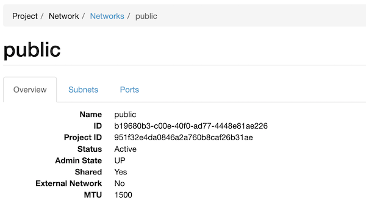
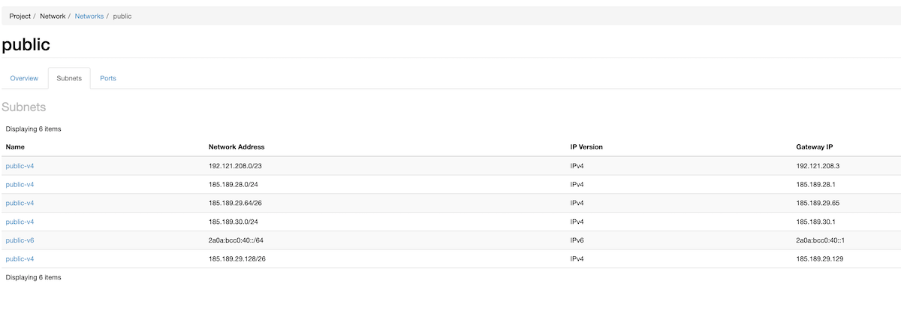
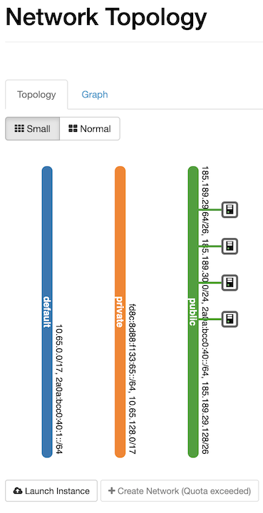
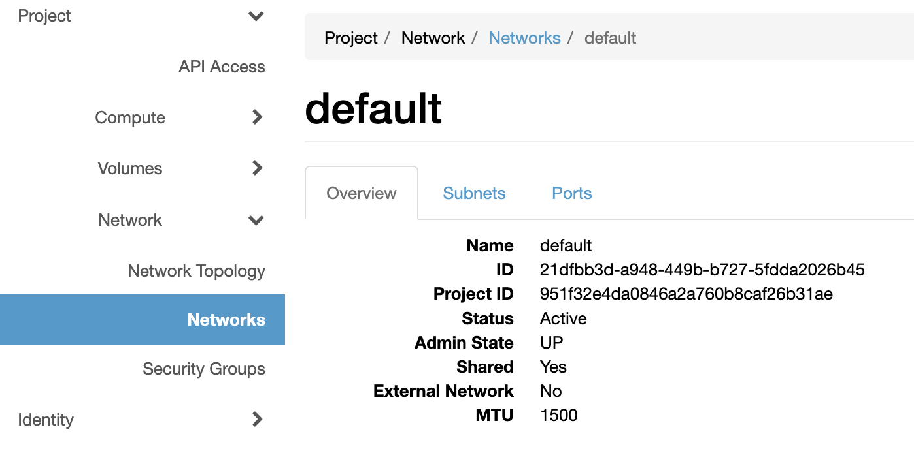
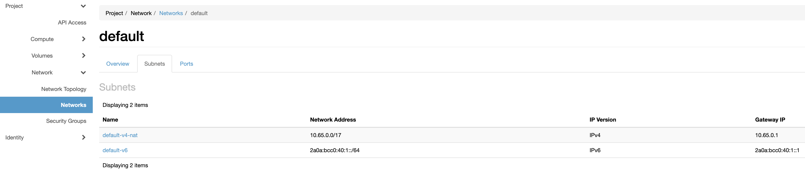
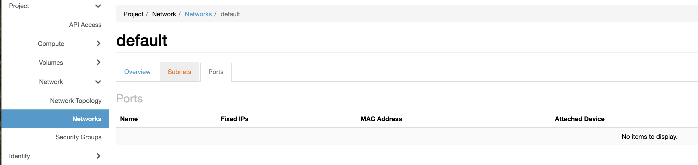

# Tutorial for Production-ready OpenStack installation

In this tutorial, we will install CCX so it is accessible from a domain, which we will call `ccx.example.com`.

After completing this tutorial, you will have a production-ready working solution.

OpenStack will be configured as the cloud provider.

## Prerequisites and Requirements for Public Installation

| Item                              | Description                                                                                                    |
|------------------------------------|----------------------------------------------------------------------------------------------------------------|
| A few sub domains                  | E.g. `ccx.example.com` and `cc.example.com`. Please note that`cc` and `ccx` are just examples names. You can change them to e.g `adm` and `dbaas`. Just make sure you replace `ccx.example.com` and `cc.example.com` with the new names in the steps below.
| Kubernetes                         | • Persistent Volume, Storage Class<br />• Nginx Ingress controller (The ingress controller must have an EXTERNAL-IP).<br />• External IP<br /><br />See [K8S requirements](docs/admin/Installation/Index.md#k8s-control-plane-requirements) for minimum size of cluster and K8S version, etc. |
| Secrets Manager                    | K8S secrets                                                                                                    |
| Openstack Credentials              | E.g an openstack RC file containing the auth urls, project id etc. |
| Infrastructure Cloud               | • One "ccx-tenant" project<br />• VM flavors<br />• Attachable volumes<br />• Public Floating IPs (IPv4)<br />• Ubuntu 22.04 image |
| Space for PVCs                     | Make sure you ahve at least 500Gi ready for production environment. Initial setup will use less, but it's better to have it in case it's needed. Depending on how detailed monitoring soultion is needed, it might require more memory. |
| S3 storage                         | For datastore backups and Operator DB backup                                                                   |
| DNS Provider                       | DNS providers supported by [external-dns](docs/admin/Installation/Dynamic-DNS.md). In order to use dynamic dns config.                               |
| Ubuntu 22.04LTS cloud image for VMs| Cloud image for VMs hosting database (i.e., db nodes/hosts)                                                    |
| Root volume for VM                 | There must be at least a 40GB root volume on each VM                                                           |
| Database volume on VM              | There must be at least 80GB data volume on each VM for database                                                |
| Project for CCX datastores         | A global project for CCX datastores                                                                            |
| Project quota                      | Sufficient quota for global project                                                                            |
| Project network                    | Appropriate network for global project                                                                         |
| Floating IPs                       | A reasonable amount of floating IPs should be pre-allocated in the network where datastores will be deployed (in the global project) |

### Storage (PVCs)

During the installation the following PVCs are created. Thus you must ensure you have enough storage available. In total, plan on using about 306Gi for the setup described in this tutorial. Depending on the production setup (how many replicas is desired, as well as how much data is needed for metrics/logs, as well as retention policy, last two volumes might need to be increased).

```
kubectl get pvc
NAME                                         STATUS   VOLUME                                     CAPACITY   ACCESS MODES       
ccxdeps-ccx-nats-js-pvc-ccxdeps-ccx-nats-0   Bound    pvc-ca4425a3-41c1-4e31-844e-c089d643967d    10Gi           RWO           
cmon-master-volume                           Bound    pvc-82bf7d9f-817d-4f0c-a14b-a95f259a6d40    40Gi           RWO            
cmon-var-lib-cmon                            Bound    pvc-ea1f97fb-3ec0-4bc6-9431-5803b1f60744    1Gi            RWO            
datadir-ccxdeps-0                            Bound    pvc-ee2924f6-b4d4-4fa4-bac3-fc6bc8426740    40Gi           RWO            
pgdata-acid-ccx-0                            Bound    pvc-b2923d0f-c775-4916-8254-d959ac34bbae    10Gi           RWO            
storage-alertmanager-0                       Bound    pvc-5ff9cd69-9426-4f35-b1a4-885f6d7dab06    5Gi            RWO            
storage-ccxdeps-loki-0                       Bound    pvc-81c89a19-6c8a-40e4-bf35-931f0bfd196c    100Gi          RWO            
victoria-metrics                             Bound    pvc-23c13e1c-3345-48c8-8796-ed1a3e1a0b04    100Gi          RWO            
```

### Ingress Controller
You must have a working and correctly setup ingress controller. 

Make sure that you have ingress controller in your cluster and you are able to setup externally facing load balancers and that either your domain name points to the ingress IP or you have external DNS configured in your cluster.

By default, CCX is configured to use `nginx` as the ingress controller (`ingressClassName: nginx`).

```
kubectl get pods --all-namespaces -l app.kubernetes.io/name=ingress-nginx
```

The output should look like:

```
NAMESPACE       NAME                                        READY   STATUS    RESTARTS   AGE
ingress-nginx   ingress-nginx-controller-659f54cbff-fcszg   1/1     Running   0          5h38m
ingress-nginx   ingress-nginx-controller-659f54cbff-lq29d   1/1     Running   0          5h38m
```

All pods should be in a READY state, and STATUS should be Running.

Finally, check the external IP address of your NGINX Ingress Controller Load Balancer by running:

```
kubectl get svc -n ingress-nginx
```

The output should look like:

```
NAME                                 TYPE           CLUSTER-IP      EXTERNAL-IP                                 PORT(S)                      AGE
ingress-nginx-controller             LoadBalancer   10.108.22.0     146.190.177.145,2a03:b0c0:3:f0::9cb5:3000   80:31096/TCP,443:31148/TCP   5h40m
ingress-nginx-controller-admission   ClusterIP      10.108.28.137   <none>                                      443/TCP                      5h40m
ingress-nginx-controller-metrics     ClusterIP      10.108.13.85    <none>                                      9090/TCP                     5h40m
```

You must have an `EXTERNAL-IP`. If not, then the installation will fail.

When deploying the Ingress Controller, make sure that the following field are entered during the deployment:
```
  controller:
    addHeaders:
      Referrer-Policy: no-referrer
      X-Content-Type-Options: nosniff
      X-Frame-Options: DENY
      X-XSS-Protection: 1; mode=block
    config:
      allow-backend-server-header: "true"
      use-forwarded-headers: "true"
      hide-headers: "Server,X-Powered-By"
```

To verify it, run the following commands:
```
kubectl describe configmap -n nginx-ingress-controller ingress-nginx-controller

Name:         ingress-nginx-controller
Namespace:    nginx-ingress-controller
Labels:       app.kubernetes.io/component=controller
              app.kubernetes.io/instance=ingress-nginx
              app.kubernetes.io/managed-by=Helm
              app.kubernetes.io/name=ingress-nginx
              app.kubernetes.io/part-of=ingress-nginx
Annotations:  meta.helm.sh/release-name: ingress-nginx
              meta.helm.sh/release-namespace: nginx-ingress-controller
Data
====
allow-backend-server-header:
----
true

hide-headers:                       
----
Server,X-Powered-By

use-forwarded-headers:
----
true

add-headers:                                                                                                                                                      ----                                                                                                                                                              nginx-ingress-controller/ingress-nginx-custom-add-headers  

#Verify that headers are there
kubectl get configmap -n nginx-ingress-controller ingress-nginx-custom-add-headers
NAME                                       DATA   AGE
ingress-nginx-custom-add-headers           4      4d21h
```

Replace the `nginx-ingress-controller` with the namespace where Ingress controler is actually deployed.


### Cert Manager
Make sure you have `cert-manager` set up:

```
kubectl get pods -n cert-manager
```

Verify that the pods are running:

```
NAME                                       READY   STATUS    RESTARTS   AGE
cert-manager-66dbc9658d-4hh55              1/1     Running   0          11d
cert-manager-cainjector-69cfd4dbc9-lmxf2   1/1     Running   0          11d
cert-manager-webhook-5f454c484c-bx8gx      1/1     Running   0          11d
```

If you don't have cert manager installed on your system, use the following commands to install it:
```
helm repo add jetstack https://charts.jetstack.io --force-update

helm install cert-manager --namespace cert-manager --version xxx jetstack/cert-manager --set crds.enabled=true #switch xxx for the version you wish to install, making sure it's not lower than 1.18.0

```
:::Note
When setting up production version of cert-manager, there are a few configuration parameter that needs to be addressed:
`replicaCount` - by default it's set to 1. To make sure it's production ready, make sure it has 2 or 3 replicas to provide high availability.
`podDisruptionBudget.enabled` - by default this is set to `false`. Make sure to change it to `true` if you changed `replicaCount` to be different than 1. 
`crds.enabled` - set to `true`. This will make sure to install all of the CRD's needed for optimal work. 
`crds.keep` - make sure it's set to `true`. This will prevent Helm from uninstalling the CRD when the Helm release is uninstalled.
:::


Make sure the `ClusterIssuer` resource exist:

```
kubectl get clusterissuer

NAME                  READY   AGE
letsencrypt-prod      True    2y233d
```

If not, then it must be created.

Below is an example for basic LetsEncrypt Issuer.

```
apiVersion: cert-manager.io/v1
kind: ClusterIssuer
metadata:
  name: letsencrypt-prod
spec:
  acme:
    email: some@email.com #any email is fine. CHANGE THIS
    server: https://acme-v02.api.letsencrypt.org/directory
    privateKeySecretRef:
      name: some-key #if not defined, it will be created. CHANGE THIS
    solvers:
    - http01:
        ingress:
          class: nginx
```
To apply this file, change the two parameters that have a comment and save it as `clusterissuer.yaml`. Then use the command:
```
kubectl apply -f clusterissuer.yaml
```
There is no need to pass the namespace as ClusterIssuer resource is cluser wide resource.
To verify, run the command: 

```
kubectl describe clusterissuer letsencrypt-prod
```

If successful, the commmand returns:
```
Status:
  Acme:
..
  Conditions:
  ..
    Message:               The ACME account was registered with the ACME server
```
If you plan to use your own custom certificate, you will have to manually upload it to the ccx namespace. To validate if the the certificate is properly created, use the following command:
```
kubectl get cert -n ccx

NAME                        READY   SECRET                      AGE
ccx-ingress-cert            True    ccx-ingress-cert            19h
```
If the value returned in the READY column is True, the certificate is valid.
If you get any errors in this process, go to the [Troubleshoting](./Production-Openshift-installation#no-valid-certificates)

### Setup DNS
Ensure you have a DNS A record set up, pointing the EXTERNAL_IP to the domain you wish to install CCX on, e.g., `ccx.example.com` (this is the endpoint the end-users will access):

`A 146.190.177.145  ccx.example.com`

Then also create a record for:

`A 146.190.177.145  cc.example.com`

`cc.example.com` will be the endpoint of ClusterControl where administrators will have detailed control and information about your datastores. We do no recommend that this endpoint it open directly to the public. 

:::note
`cc.example.com` and `ccx.example.com` are just examples. You can change them to e.g `adm` and `dbaas`. Just make sure you replace `ccx.example.com` and `cc.example.com` with the new names in the steps below.
:::

## Preparations

### Add Severalnines Helm Chart Repository

Setup the Helm repo:

```
helm repo add s9s https://severalnines.github.io/helm-charts/
helm repo update
```

The complete helm-charts are located on [GitHub](https://github.com/severalnines/helm-charts/tree/main/charts/ccx).

### Create a Namespace

We will deploy in a namespace called `ccx`:

```
kubectl create namespace ccx
kubectl config set-context --current --namespace=ccx
```

## Install CCX Dependencies

First, we need to install the CCX dependencies (`ccxdeps`):

- PostgreSQL - [read more about the operator](./Postgres-Operator-Installation).
- MySQL - [read more about the operator](./Mysql-Operator-Installation). Please take a look at how to setup backups in the documentation, as it will be needed on the production environment.
- NATS
- VictoriaMetrics
- Loki
- Keycloak

### Installing the Dependencies

Create a new file called `ccxdeps.yaml`. You can use the values below and modify them per your needs.
```
mysql-innodbcluster:
  serverInstances: 3 # This is something you can chose, but it can only be 1,3,5,7 or 9.
  podSpec:
    containers:
    - name: mysql
      resources:
        requests:
          memory: "2048Mi"
victoria-metrics-alert:
  enabled: true
victoria-metrics-single:
  enabled: true
ccx-monitoring:
  alertmanager:
    enabled: false
  enabled: true
  loki:
    gateway:
      ingress:
        hosts:
        - host: some-loki-domain.com
          paths:
          - path: /loki
            pathType: Prefix
        tls:
        - hosts:
          - some-loki-domain.com
          secretName: loki-gateway-tls
    loki_host_url: some-loki-domain.com
oracle-mysql-operator:
  enabled: true
installOperators: true

```
Please take a look at all [values](https://github.com/severalnines/helm-charts/blob/main/charts/ccxdeps/values.yaml), as you might be interested in some of the additional flags.

```
helm install ccxdeps s9s/ccxdeps --debug --wait -n ccx -f ccxdeps.yaml
```

Check that the pods are `RUNNING`:

```
kubectl get pods -n ccx
NAME                                         READY   STATUS    RESTARTS   AGE
acid-ccx-0                                   1/1     Running   0          7m13s
alertmanager-0                               1/1     Running   0          7m22s
ccxdeps-0                                    2/2     Running   0          67s
ccxdeps-1                                    2/2     Running   0          67s
ccxdeps-2                                    2/2     Running   0          67s
ccxdeps-ccx-nats-0                           3/3     Running   0          7m22s
ccxdeps-ccx-nats-box-c777b9b98-thhfs         1/1     Running   0          7m22s
ccxdeps-keycloak-0                           1/1     Running   0          7m22s
ccxdeps-loki-0                               1/1     Running   0          7m22s
ccxdeps-loki-gateway-56c8f56c6b-kw9s8        1/1     Running   0          7m22s
ccxdeps-postgres-operator-6847687666-79x8l   1/1     Running   0          7m22s
mysql-operator-5876cf5b66-6knkp              1/1     Running   0          27s
victoria-metrics-845694c98d-24wng            1/1     Running   0          7m22s
victoria-metrics-alert-7f695bf5c8-96ch5      1/1     Running   0          7m22s
```

:::note

If the mysql-operator pod fails to start with the error (use `kubectl logs mysql-operator-5876cf5b66-6knkp` to check):

```
persists try setting MYSQL_OPERATOR_K8S_CLUSTER_DOMAIN via environment
```

Then do:

```
kubectl edit deployment -n ccx mysql-operator
```

Locate the `env` section and set:

```yaml
env:
  - name: MYSQL_OPERATOR_K8S_CLUSTER_DOMAIN
    value: "cluster.local"
```

Finally, restart:

```
kubectl rollout restart deployment -n ccx mysql-operator
```

:::

## Configuring Cloud Credentials in K8s Secrets
In order to configure CCX for Openstack you will need to provide cloud credentials.
Cloud credentials should be created as Kubernetes secrets in the format specified in [secrets-template-openstack.yaml](https://github.com/severalnines/helm-charts/blob/main/charts/ccx/secrets-template-openstack.yaml). The template looks like this:

### Using the template (recommended first time)

In the template, the secrets are specified in clear text (stringData):

```
---
apiVersion: v1
kind: Secret
metadata:
  name: openstack
type: Opaque
stringData:
  MYCLOUD_AUTH_URL: YOUR
  MYCLOUD_PASSWORD: OPENSTACK
  MYCLOUD_PROJECT_ID: CREDENTIALS
  MYCLOUD_USER_DOMAIN: HERE
  MYCLOUD_USERNAME: AND_HERE
---
apiVersion: v1
kind: Secret
metadata:
  name: openstack-s3
type: Opaque
stringData:
  MYCLOUD_S3_ENDPOINT: CHANGE_ME
  MYCLOUD_S3_ACCESSKEY: CHANGE_ME
  MYCLOUD_S3_SECRETKEY: CHANGE_ME
  MYCLOUD_S3_INSECURE_SSL: false #'true' if your S3 connection is unencrypted (http)  or 'false' if it is (https).
```

:::important
The secrets contain a number of fields starting with `MYCLOUD`. This must be replaced with how you want to identify your cloud.

If you want to identifty the cloud as `grok`, then replace `MYCLOUD` with `grok` in the `openstack-secrets.yaml` file and make sure you use `grok` in the `minimal-values.yaml` file referenced later in this tutorial. Later, your will also set a real name for your cloud. 
:::

`MYCLOUD_S3_ENDPOINT` must be specified without `http://` or `https://`. Thus it should look like `s3.example.com`.

 Make sure you have your OpenStack RC file handy as it contains the information you need. Also ensure you have S3 credentials. S3 will be used to store backup data coming from the datastores the end user deploys.

 Fill out the details, and save the file as `openstack-secrets.yaml`, and then run:

```
 kubectl apply -n ccx -f openstack-secrets.yaml
```

### Configure secrets using a script - base64 encoded (recommended for production)

You can also use the script [create-openstack-secrets.sh](https://github.com/severalnines/helm-charts/tree/main/charts/ccx/scripts) which will prompt you to enter the OpenStack credentials. It will create the credentials base64 encoded.
Download the scripts:

```
curl -o create-openstack-secrets.sh https://raw.githubusercontent.com/severalnines/helm-charts/main/charts/ccx/scripts/openstack/create-openstack-secrets.sh
curl -o create-openstack-s3-secrets.sh https://raw.githubusercontent.com/severalnines/helm-charts/main/charts/ccx/scripts/openstack/create-openstack-s3-secrets.sh
chmod u+x create-openstack-secrets.sh
chmod u+x create-openstack-s3-secrets.sh
```

Now run the scripts and enter the details:

```
./create-openstack-secrets.sh
```

and to generate credentials for S3:

```
./create-openstack-s3-secrets.sh
```

Apply the generated secrets files:

```
kubectl apply -n ccx -f openstack-secrets.yaml
kubectl apply -n ccx -f openstack-s3-secrets.yaml
```

### Create Email secret

In oder to setup the emailing for the ccx, create the secret in accordance to the following template:
```
apiVersion: v1
data:
  SMTP_FROM:  #email adress from which emails will be sent
  SMTP_FROM_NAME: CCX
  SMTP_HOST: #sender host
  SMTP_PASSWORD: #email password
  SMTP_PORT: #port
  SMTP_USERNAME: #username
kind: Secret
metadata:
  name: smtp
  namespace: ccx
type: Opaque

```

Use `kubectl apply -f smtp.yaml` to apply the secret.

More documentation can be found [here.](../Day2/Notifications.md)

### Verify the secrets

Verify that the secrets are created:

```
kubectl get secrets -n ccx
```

:::important
The secrets contain a number of fields starting with `MYCLOUD`.
This identifier `MYCLOUD` must match the name `- code: mycloud` and `mycloud:` in your configuration.

Thus, if you have a cloud called `grok`, then replace `MYCLOUD` with `grok` in the `openstack-secrets.yaml` and `openstack-s3-secrets.yaml` files and make sure you use `grok` in the `minimal-values.yaml` file referenced later in this tutorial.
:::

### Create Security Group ccx-common

You must also create a security group. Let's call it `ccx-common`.

`ccx-common` must allow all TCP traffic from all k8s nodes where CCX is running. 

The Egress must also be allowed. Below is a screenshot showing the `ccx-common`. The EXTERNAL-IP is specified for the port range 1-65535.

:::important
If you have three worker nodes, and they have different IP addresses then you must add three entries to the security group, allowing 1-65535 for each IP address as egress.
:::


## Prepare the OpenStack Values File and OpenStack

We will use a [minimal OpenStack configuration](https://github.com/severalnines/helm-charts/blob/main/charts/ccx/minimal-values-openstack.yaml) as the template.
At this stage, you must have the following information/resources created in your OpenStack project:

| Item            | Description                                                                                                                                                   |
|----------------------|---------------------------------------------------------------------------------------------------------------------------------------------------------------|
| `floating_network_id`| This is the public network. All instances must be assigned a public IP (read more below).                                                                    |
| `network_id`         | This is the private network. You must create this in OpenStack.                                                                                               |
| `project_id`         | The project ID where the resources will be deployed. This is your OpenStack project ID. All resources are deployed in the same OpenStack project.            |
| `image_id`           | This image must be Ubuntu 22.04 of a recent patch level. Cloud-init will install the necessary tools on the image. Can be updated for new versions/patches.  |
| `instance_type`      | Code for the instance type you will use, e.g., `x4.2c4m.100g`. Recommended: 2vCPU and 4GB minimum. Must match an existing OpenStack flavor.                   |
| `volume_type`        | Code for the volume type you will use, e.g., `fastdisk`. Must match the OpenStack volume type name.                                                           |
| `region`             | Name of the region, e.g., `nova` or `sto1`.                                                                                                                   |
| `ccx-common`         | Security group.                                                                                                                                               |

In the network section in the values.yaml file that will be created in the next step we have a network called `code: public`, and the ID of this network is also set in the `floating_network_id: b19680b3-c00e-40f0-ad77-4448e81ae226`. This is the public pool of IP addresses that are assigned to the VMs. 

Another network, for internal/private communication (marked with `network_id: 21dfbb3d-a948-449b-b727-5fdda2026b45` below) between VMs are also needed to support database replication. These networks are outlined below.

:::important 

The VMs that will be create MUST be reachable from the CCX controlplane, hence the use if public IPs in this setup.

::: 

### Public network

The CCX controlplane must be able to access the instances over the network. We recommend using public IPs.

The public network name is identified by the name of the public network as used in Openstack. In the example below we call the network `public`.

Here is an example how it is created (and also showing four instances attached to the public network). In the `minimal-openstack.yaml` the `floating_network_id` represents this network. 
Moreover, if you use a pool of public ip addresses, then you need to set `public_pool` to the same value as the `floating_network_id`.


Specifying a public pool allows OpenStack to automatically create public IPs. 

If the public pool is not specified then CCX will explicitly create and attach public IPs to the instance. Thus, configuring this depends on how you setup and design your Openstack network. We recommend that CCX explicitly create and attach public ip, thus not using the public pool.

:::note

The most common is not to use the `public_pool` (i.e. leave it empty) and just specify the `floating_network_id`.

:::

Below are examples of a public network setup for OpenStack.

#### Overview



#### Subnets
Here, in this picture, the `public` network is configured with IP pools, thus `public_pool` is set to the same value as `floating_network_id`:




#### Topology view



### Private/internal network


Then for the internal network (`network_id: 21dfbb3d-a948-449b-b727-5fdda2026b45`) below, these diagrams shows the setup of the 'default' network. It will be used for internal communication between the VMs (database replication).

#### Overview



#### Subnets


#### Ports



Download the minimal values file:

```
curl -o minimal-openstack.yaml https://raw.githubusercontent.com/severalnines/helm-charts/main/charts/ccx/minimal-values-openstack.yaml
```

Edit the `minimal-openstack.yaml` and replace all `MY_*` with the values for `floating_network_id`, `network_id`, etc. Double-check that you do not omit or make any typos.
Also, ensure that instance types and volume types are specified.

### Sample Minimal OpenStack Values File
Below is an example. Please note that you can add more instance types, volume types, clouds, etc. We recommend starting small and expanding the configuration.

:::note

A number of identifiers are case sensitive: `ccx.config.clouds[].regions[].code`, `ccx.config.clouds[].regions[].availabiliity_zones[].code`, `ccx.services.deployer.config.openstack_vendors[].regions[].identifier` and also the codes for the `instance_types`, `flavors`, `volumes` are `network_types` case-sensitive. Be consistent!

:::

```yaml
cc:
  cidr: 0.0.0.0/0 #setup according to your network
ccFQDN: cc.ccx.somedomain.com # dns name for ccx
ccxFQDN: ccx.somedomain.com # dns name for cc
ccx:
  cidr: 0.0.0.0/0 #setup according to your network
  cloudSecrets: ccx # List of Kubernetes secrets containing cloud credentials.
  - openstack # This secret must exist in Kubernetes. See 'secrets-template.yaml' for reference.
  - openstack-s3
  - smtp #secret made from email step
  config:
    clouds:
    - code: mycloud # Unique code for your cloud provider
      name: MyCloudName # Human-readable name
      instance_types: #Type of instances that will be used 
      - code: large-1 #code must match the one used on cloud
        cpu: 2           #must match the instance template 
        disk_size: 64
        name: Small
        ram: 8  #must match the instance template 
        type: large-1
      - code: large-2
        cpu: 4
        disk_size: 64
        name: Medium
        ram: 16
        type: large-2
      network_types:
      - code: public
        in_vpc: false
        info: |
          All instances will be deployed with public IPs. Access to the public IPs is controlled by a firewall.
        name: Public
      regions:
      - availability_zones:
        - code: nova # Case-sensitive 
          name: az1 # Human-readable name
        city: Stockholm
        code: my-region1 # this is your region code. Case-sensitive.
        continent_code: EU
        country_code: SE
        display_code: my-region1
        name: my-region1
      volume_types:
      - code: ssd
        has_iops: false
        info: Optimized for performance
        name: SSD network attached
        size:
          default: 60
          max: 1000
          min: 30
    databases: #database variations
    - code: mariadb
      enabled: true
      info: Deploy MariaDB with either multi-master (MariaDB Cluster) or master/replicas.
      name: MariaDB
      num_nodes:
      - 1
      - 2
      - 3
      ports:
      - 3306
      types:
      - code: galera
        name: Multi-Master
        size_hints:
          "1": 1 master node
          "3": 3 multi-master nodes
      - code: replication
        name: Master / Replicas
        size_hints:
          "1": 1 master node
          "2": 1 master, 1 replica
          "3": 1 master, 2 replicas
      versions:
      - "10.11"
      - "11.4"
    - code: percona
      enabled: true
      info: Deploy MySQL with either multi-master (PXC) or master/replicas.
      name: MySQL
      num_nodes:
      - 1
      - 2
      - 3
      ports:
      - 3306
      types:
      - code: galera
        name: Multi-Master
        size_hints:
          "1": 1 master node
          "3": 3 multi-master nodes
      - code: replication
        name: Master / Replicas
        size_hints:
          "1": 1 master node
          "2": 1 master, 1 replica
          "3": 1 master, 2 replicas
      versions:
      - "8"
      - "8.4"
    - code: postgres
      enabled: true
      info: Deploy PostgreSQL using asynchronous replication for high-availability.
      name: PostgreSQL
      num_nodes:
      - 1
      - 2
      - 3
      ports:
      - 5432
      types:
      - code: postgres_streaming
        name: Streaming Replication
        size_hints:
          "1": 1 master node
          "2": 1 master, 1 replica
          "3": 1 master, 2 replicas
      versions:
      - "14"
      - "15"
      - "16"
    - code: valkey_sentinel
      enabled: true
      info: Deploy Valkey Sentinel.
      name: Valkey
      num_nodes:
      - 1
      - 3
      ports:
      - 6379
      types:
      - code: valkey_sentinel
        name: Sentinel
        size_hints:
          "1": 1 master node
          "3": 1 master, 2 replicas
      versions:
      - "8"
    - code: microsoft
      enabled: true
      info: Deploy Microsoft SQL Server.
      name: Microsoft SQL Server
      num_nodes:
      - 1
      - 2
      ports:
      - 1433
      types:
      - code: mssql_single
        name: Single server
        size_hints:
          "1": 1 node
      - code: mssql_ao_async
        name: Always On (async commit mode)
        size_hints:
          "2": 1 primary, 1 secondary
      versions:
      - "2022"
  env:
    DISABLE_ROLLBACK: "false" #if a datastore fails to deploy, then it will not be deleted. Helps with debugging. Set to "false" for prod.
  ingress:
    annotations:
      external-dns.alpha.kubernetes.io/hostname: somedomain.com # domain used for databases. It has to match with ExternalDNS used one.
    ssl:
      clusterIssuer: letsencrypt-prod # Make sure it's the one you created in cert-manager step
  services:
    deployer:
      config:
        openstack_vendors:
          mycloud:
            compute_api_microversion: "2.79"
            floating_network_id: some_id  # Replace with actual ID
            network_api_version: NetworkNeutron
            network_id: some_network_id # Replace with actual network ID
            project_id: project_id # Replace with your OpenStack project ID
            regions: 
              sto1: # region id, must be consistently set/named. Case-sensitive.
                image_id: 936c8ba7-343a-4172-8eab-86dda97f12c5  # Replace with image ID for the region
                # secgrp_name refers to the security group name used by CCX to access datastore VMs.
                # It must be created manually and allow all TCP traffic from all Kubernetes nodes where CCX is running.
                secgrp_name: ccx-common  # Recommended to use a dedicated security group
    uiapp:
      env:
        FE_REACT_APP_FAVICON_URL: your_icon_link #link to your company icon
        FE_REACT_APP_LOGO_URL: your_link #link to your company logo
        FE_EXTERNAL_CSS_URL: your.css.url #ult to the ccss you will be using 
        FE_NODE_ENV: "production"
        FE_VPC_DISABLED: true #turn off this unless using AWS
      replicas: 3
    runner:
      replicas: 5 # Minimum is 3 that should be used in prduction. Prefferable is to have 5 or more
  userDomain: somedomain.com # domain used for databases. It has to match with ExternalDNS used one.
cmon:
  licence: xxx # insert licence here
```

## Install CCX
Now it is finally time to install CCX.

Make sure you change `cc.ccx.somedomain.com` and `ccx.somedomain.com` to the domain names you use. 
Also change the `clusterIssuer` to the one you created previously.

```
helm upgrade --install ccx s9s/ccx --debug --wait -f minimal-openstack.yaml
```

Wait for it to finish, and check that the pods are `RUNNING`:

```
kubectl get pods -n ccx
```

## CCX Web UI

Open `https://ccx.example.com/auth/register?from=ccx` in a web browser and register a new user. Please note that email notifications are not yet configured. You can just press the `Back` button after the signup.

Try to deploy a datastore. If it fails at around 8% or 16%, then there is a problem with the infrastructure. See the troubleshooting section below for clues.

## Basic Troubleshooting

During the creation of a datastore, several resources are set up: Security groups, volumes, networks, and instances.
If you run into issues, a good place to start is to look at logs from the `ccx-runner-service-NNN` pod:

```
kubectl logs ccx-runner-service-NNNN
```

### Deployment fails 

Usually deployment fails because of:

- firewall issues (ccx-common does not contain all the IP of all k8s worker nodes).
- quota issues.
- cloudinit fails.
- other networking issues preventing the CCX to reach the VM/instance. 

Check the following

- Inspect the logs of the ccx-runner service: `kubectl logs ccx-runner-service-NNNN`
- See if you can SSH into the deployed VM and look for errors in cloudint (`/var/log/cloud-init.log` and `/var/log/cloud-init-output.log`). See below how to SSH to the VM using `ssh-db-node`:

**ssh-db-node**
Obtain the UUID of the datastore from the CCX UI. 

```
kubectl run -it --rm ssh-db-node --image=europe-docker.pkg.dev/severalnines-public/ccx/ssh-db-node:latest --restart=Never -- <store_uuid>
```

### Timeouts

If you see issues with timeouts:

- Ensure you have updated the `ccx-common` security group with the correct IP address (the EXTERNAL-IP), but you might also need to add the IPs of the nodes.


### No Valid Certificates

First check the currently existing certificates with 

```bash
kubectl get cert -n ccx

NAME                        READY   SECRET                      AGE
ccx-ingress-cert            False   ccx-ingress-cert            19h
```
If the certificate has `False` in the READY column, procced with the following:

```bash
kubectl describe certificate -n ccx ccx-ingress
```

If the certificate required by the ingress is missing, run:

```bash
kubectl get challenges -n ccx
```

In the `status` field of the challenge, you will see the error that is preventing the certificate from being created or functioning correctly.  
If no challenge exists, run the following commands:

```bash
kubectl get order.acme.cert-manager.io
NAME                        STATE     AGE
cc.localhost-xxxxxxx        errored   6h23m

kubectl describe order.acme.cert-manager.io cc.localhost-xxxxxxx | grep Reason
```

This will display the reason why the certificate could not be created.

If the error is something like `Error presenting challenge: admission webhook "validate.nginx.ingress.kubernetes.io" denied the request: ingress contains invalid paths: path /.well-known/acme-challenge/6Uf-bGI5H8fwC-hY3ItfraPvG__PvowY--WL5-hiyWw cannot be used with pathType Exact`, go to the nginx-ingress-controler namespace, and make sure that the `use-proxy-protocol` is set to false in the ConfigurationMap. You can use `kubectl get configmap -n ingress-nginx` to get the ConfigurationMap. The reason this is something that needs to be done is that unless LoadBalancer that is being used is custom installed (e.x HAProxy), OpenStack doesn't support proxy protocol.

If that doesn't help or using the `use-proxy-protocol` is necessary, do the following:
```bash
kubectl get validatingwebhookconfiguration
NAME                                 WEBHOOKS   AGE
cert-manager-webhook                 1          44h
ingress-nginx-xxxxx-admission        1          36d
```
Edit the ingress-nginx-xxxxx-admission, such that you add in the namespaceSelecor the following:
```
namespaceSelector:
  matchExpressions:
  - key: nginx-webhook
    operator: NotIn
    values:
    - disabled
```
Save it and restart all of the nginx ingress pods. After that is done, add label to the ccx namespace `kubernetes.io/metadata.name=ccx`.
Give it 5 minutes for the internal stuff to sync, than remove the `ccx-ingress` manually. This will cause it to be recreated, and now it should be in ready state within few minutes. 

See our [Troubleshooting](docs/admin/Troubleshooting/Troubleshooting.md) section for more information.

## Next Steps

- [Set up and configure ExternalDNS](docs/admin/Installation/Dynamic-DNS.md). This will give your endusers immutable endpoints to the database. Please make sure you have deleted all datastores before you set it up. 
- [Run End-to-End Tests](docs/admin/Testing/E2E-tests.md).
- [White-labeling UI and customization](docs/admin/Customisation/Frontend.md).
- [JWT authentication](docs/admin/Customisation/JWT.md).
- Configure more Instance types (VMs, storage, etc.)
