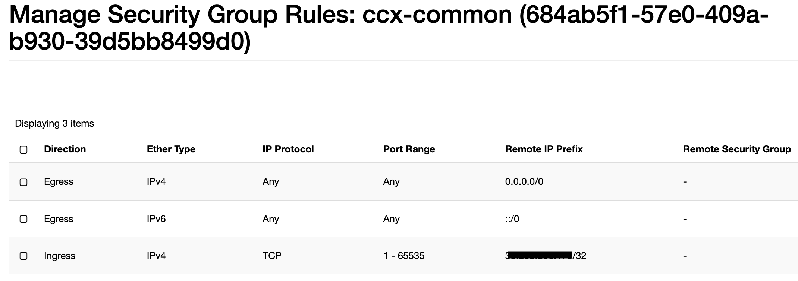
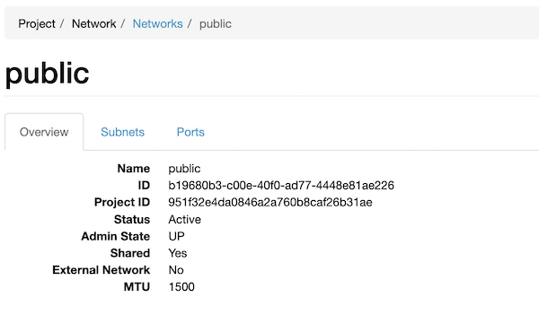
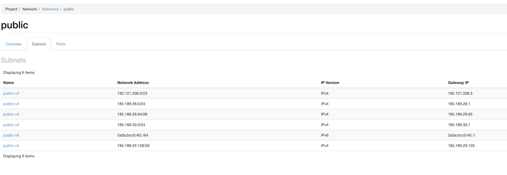
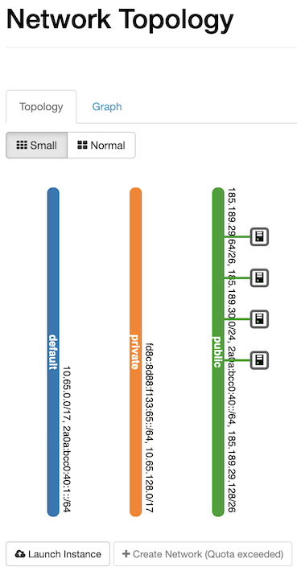
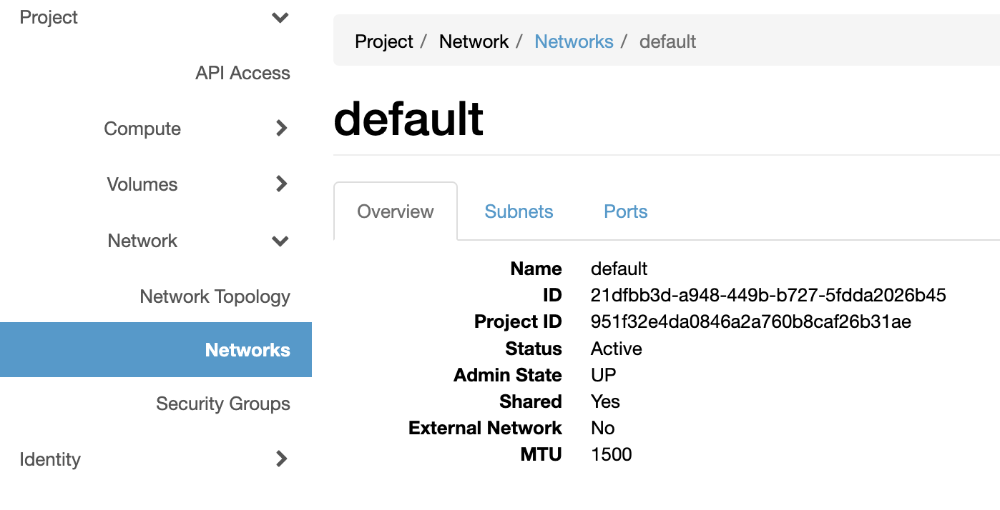
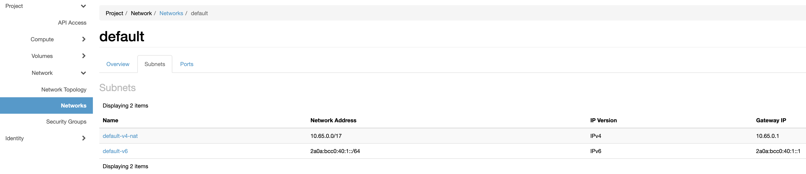
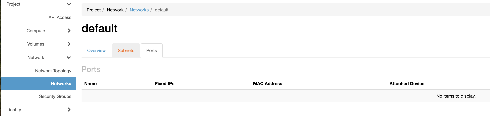

# Installing CCX on OpenStack

*For laptop/desktop installation, see [Install CCX on a Laptop](CCX-Install-Laptop.md).*

This tutorial walks you through installing CCX on OpenStack so it is accessible from a public domain. By the end, you will have a working CCX instance reachable at `ccx.example.com`, with ClusterControl available at `cc.example.com`.

:::note
`cc.example.com` and `ccx.example.com` are placeholders. You can use any subdomain names you prefer — just replace every occurrence in the steps below.
:::

**What you will set up:**
- CCX dependencies (PostgreSQL, MySQL, NATS, VictoriaMetrics, Loki, Keycloak)
- OpenStack cloud credentials and security groups
- CCX itself, exposed via Nginx Ingress with TLS

External DNS configuration is not covered here but is linked in [Next Steps](#next-steps).

---

## Prerequisites

### Kubernetes Requirements

Ensure your cluster meets these requirements before starting. See [K8S requirements](Index.md#k8s-control-plane-requirements) for minimum cluster size and Kubernetes version.

| Requirement | Details |
|---|---|
| Subdomains | Two subdomains, e.g. `ccx.example.com` (end-user portal) and `cc.example.com` (admin portal). |
| Nginx Ingress Controller | Must have an `EXTERNAL-IP` assigned to its LoadBalancer service. |
| Cert Manager | Must have a working `ClusterIssuer` (e.g. `letsencrypt-prod`). |
| Persistent Volume / Storage Class | ~100Gi of storage for PVCs in this tutorial; more for production. |
| S3 Storage | For datastore backups and Operator DB backups. |
| DNS Provider | DNS A records pointing to the ingress `EXTERNAL-IP`, or a provider supported by [external-dns](Dynamic-DNS.md). |

**PVCs created during installation (~100Gi total):**

```
NAME                                         CAPACITY   STORAGECLASS
ccxdeps-ccx-nats-js-pvc-ccxdeps-ccx-nats-0   10Gi       <your-storage-class>
cmon-master-volume                           20Gi       <your-storage-class>
cmon-var-lib-cmon                            1Gi        <your-storage-class>
datadir-ccxdeps-0                            20Gi       <your-storage-class>
pgdata-acid-ccx-0                            10Gi       <your-storage-class>
storage-alertmanager-0                       1Gi        <your-storage-class>
storage-ccxdeps-loki-0                       10Gi       <your-storage-class>
victoria-metrics                             16Gi       <your-storage-class>
```

### OpenStack Requirements

| Requirement | Details |
|---|---|
| OpenStack RC file | Auth URL, project ID, username, password, and user domain. |
| Project for CCX datastores | A dedicated project (e.g. `ccx-tenant`) where database VMs are deployed. |
| Project quota | Sufficient quota for VMs, volumes, and floating IPs. |
| Ubuntu 22.04 LTS cloud image | Used for database node VMs. |
| VM root volume | Minimum 20GB per VM. |
| VM data volume | Minimum 80GB per VM. |
| VM flavors | Minimum 2 vCPU / 4GB RAM recommended. |
| Public floating IPs | Pre-allocate a reasonable number in the project network. |
| Private network | For internal VM-to-VM communication (database replication). |

---

## Step 1 — Verify Kubernetes Infrastructure

Before installing CCX, confirm that the required Kubernetes components are healthy.

### Verify Nginx Ingress

```bash
kubectl get pods --all-namespaces -l app.kubernetes.io/name=ingress-nginx
```

All pods must show `READY` and `STATUS: Running`:

```
NAMESPACE       NAME                                        READY   STATUS    RESTARTS   AGE
ingress-nginx   ingress-nginx-controller-659f54cbff-fcszg   1/1     Running   0          5h38m
ingress-nginx   ingress-nginx-controller-659f54cbff-lq29d   1/1     Running   0          5h38m
```

Then verify the ingress service has an `EXTERNAL-IP`:

```bash
kubectl get svc -n ingress-nginx
```

```
NAME                       TYPE           CLUSTER-IP     EXTERNAL-IP       PORT(S)
ingress-nginx-controller   LoadBalancer   10.108.22.0    146.190.177.145   80:31096/TCP,443:31148/TCP
```

:::important
The `EXTERNAL-IP` must be set. If it shows `<pending>`, the installation will fail.
:::

### Verify Cert Manager

```bash
kubectl get pods -n cert-manager
```

All three pods must be `Running`:

```
NAME                                       READY   STATUS    RESTARTS   AGE
cert-manager-66dbc9658d-4hh55              1/1     Running   0          11d
cert-manager-cainjector-69cfd4dbc9-lmxf2   1/1     Running   0          11d
cert-manager-webhook-5f454c484c-bx8gx      1/1     Running   0          11d
```

Check that a `ClusterIssuer` exists:

```bash
kubectl get clusterissuer
```

```
NAME               READY   AGE
letsencrypt-prod   True    2y233d
```

If no `ClusterIssuer` exists, create one. Save the following as `clusterissuer.yaml`, replacing the two commented fields:

```yaml
apiVersion: cert-manager.io/v1
kind: ClusterIssuer
metadata:
  name: letsencrypt-prod
spec:
  acme:
    email: some@email.com        # CHANGE THIS
    server: https://acme-v02.api.letsencrypt.org/directory
    privateKeySecretRef:
      name: some-key             # CHANGE THIS
    solvers:
    - http01:
        ingress:
          class: nginx
```

```bash
kubectl apply -f clusterissuer.yaml
```

Verify the issuer registered successfully:

```bash
kubectl describe clusterissuer letsencrypt-prod
```

Look for this in the output:

```
Message: The ACME account was registered with the ACME server
```

If you are using a custom certificate instead of Let's Encrypt, upload it manually to the `ccx` namespace. Validate it with:

```bash
kubectl get cert -n ccx
```

The `READY` column must show `True`.

### Configure DNS

Create two DNS `A` records pointing to your ingress `EXTERNAL-IP`:

```
A  146.190.177.145  ccx.example.com
A  146.190.177.145  cc.example.com
```

- `ccx.example.com` — end-user portal
- `cc.example.com` — ClusterControl admin portal (not recommended to expose publicly)

---

## Step 2 — Add the Helm Repository and Create a Namespace

```bash
helm repo add s9s https://severalnines.github.io/helm-charts/
helm repo update
```

The full chart source is on [GitHub](https://github.com/severalnines/helm-charts/tree/main/charts/ccx).

Create and activate the `ccx` namespace:

```bash
kubectl create namespace ccx
kubectl config set-context --current --namespace=ccx
```

---

## Step 3 — Install CCX Dependencies

Install the `ccxdeps` chart, which includes:
- PostgreSQL ([operator docs](./Postgres-Operator-Installation))
- MySQL ([operator docs](./Mysql-Operator-Installation))
- NATS
- VictoriaMetrics
- Loki
- Keycloak

```bash
helm install ccxdeps s9s/ccxdeps --debug --wait -n ccx
```

Verify all pods are `Running`:

```bash
kubectl get pods -n ccx
```

```
NAME                                         READY   STATUS    RESTARTS   AGE
acid-ccx-0                                   1/1     Running   0          7m13s
alertmanager-0                               1/1     Running   0          7m22s
ccxdeps-0                                    1/2     Running   0          67s
ccxdeps-ccx-nats-0                           3/3     Running   0          7m22s
ccxdeps-ccx-nats-box-c777b9b98-thhfs         1/1     Running   0          7m22s
ccxdeps-keycloak-0                           1/1     Running   0          7m22s
ccxdeps-loki-0                               1/1     Running   0          7m22s
ccxdeps-loki-gateway-56c8f56c6b-kw9s8        1/1     Running   0          7m22s
ccxdeps-postgres-operator-6847687666-79x8l   1/1     Running   0          7m22s
mysql-operator-5876cf5b66-6knkp              1/1     Running   0          27s
victoria-metrics-845694c98d-24wng            1/1     Running   0          7m22s
victoria-metrics-alert-7f695bf5c8-96ch5      1/1     Running   0          7m22s
```

:::note
**MySQL operator failing to start?** If `kubectl logs mysql-operator-<pod-id>` shows:

```
persists try setting MYSQL_OPERATOR_K8S_CLUSTER_DOMAIN via environment
```

Edit the deployment and add the environment variable:

```bash
kubectl edit deployment -n ccx mysql-operator
```

In the `env` section, add:

```yaml
env:
  - name: MYSQL_OPERATOR_K8S_CLUSTER_DOMAIN
    value: "cluster.local"
```

Then restart:

```bash
kubectl rollout restart deployment -n ccx mysql-operator
```
:::

---

## Step 4 — Configure OpenStack Credentials

### About the Cloud Identifier

Throughout this step you will see the placeholder `MYCLOUD`. This is the internal identifier for your OpenStack cloud and **must be consistent** across your secrets and the values file in Step 5.

For example, if you want to name your cloud `grok`:
- Replace `MYCLOUD` with `grok` in the secrets files
- Use `grok` as the `code:` value in `minimal-openstack.yaml`

### Option A — Template File (recommended for first-time setup)

Download the [secrets template](https://github.com/severalnines/helm-charts/blob/main/charts/ccx/secrets-template-openstack.yaml). The template uses `stringData` (plain text):

```yaml
---
apiVersion: v1
kind: Secret
metadata:
  name: openstack
type: Opaque
stringData:
  MYCLOUD_AUTH_URL: YOUR
  MYCLOUD_PASSWORD: OPENSTACK
  MYCLOUD_PROJECT_ID: CREDENTIALS
  MYCLOUD_USER_DOMAIN: HERE
  MYCLOUD_USERNAME: AND_HERE
---
apiVersion: v1
kind: Secret
metadata:
  name: openstack-s3
type: Opaque
stringData:
  MYCLOUD_S3_ENDPOINT: CHANGE_ME    # Without protocol prefix, e.g. s3.example.com
  MYCLOUD_S3_ACCESSKEY: CHANGE_ME
  MYCLOUD_S3_SECRETKEY: CHANGE_ME
  MYCLOUD_S3_INSECURE_SSL: "false"  # true = http, false = https
```

Fill in your OpenStack RC file values and S3 credentials, save as `openstack-secrets.yaml`, then apply:

```bash
kubectl apply -n ccx -f openstack-secrets.yaml
```

### Option B — Script with Base64 Encoding (recommended for production)

Download and run the helper scripts:

```bash
curl -o create-openstack-secrets.sh https://raw.githubusercontent.com/severalnines/helm-charts/main/charts/ccx/scripts/openstack/create-openstack-secrets.sh
curl -o create-openstack-s3-secrets.sh https://raw.githubusercontent.com/severalnines/helm-charts/main/charts/ccx/scripts/openstack/create-openstack-s3-secrets.sh
chmod u+x create-openstack-secrets.sh create-openstack-s3-secrets.sh
```

```bash
./create-openstack-secrets.sh
./create-openstack-s3-secrets.sh
```

Apply the generated files:

```bash
kubectl apply -n ccx -f openstack-secrets.yaml
kubectl apply -n ccx -f openstack-s3-secrets.yaml
```

### Verify Secrets

```bash
kubectl get secrets -n ccx
```

Confirm both `openstack` and `openstack-s3` secrets appear in the list.

---

## Step 5 — Prepare the OpenStack Configuration

### Gather Required OpenStack Values

You will need the following IDs and codes from your OpenStack project:

| Field | Description |
|---|---|
| `floating_network_id` | ID of the public network used for floating IPs. |
| `network_id` | ID of the private/internal network used for VM-to-VM communication. |
| `project_id` | OpenStack project ID where datastores will be deployed. |
| `image_id` | ID of the Ubuntu 22.04 LTS cloud image. |
| `instance_type` | Flavor code, e.g. `x4.2c4m.100g` (2 vCPU, 4GB RAM minimum). |
| `volume_type` | Volume type name, e.g. `fastdisk`. Must match exactly in OpenStack. |
| `region` | Region name, e.g. `nova` or `sto1`. |

### Create the `ccx-common` Security Group

Create a security group named `ccx-common` in your OpenStack project. It must allow all TCP traffic (ports 1–65535) from each Kubernetes worker node IP, both ingress and egress.

:::important
If you have three worker nodes with different IP addresses, add a separate rule for each IP allowing ports 1–65535.
:::

For a full list of ports and external endpoints that must be reachable — including database vendor package repositories, backup storage, and notification services — see the [Firewall and Air-Gapped Deployment](Firewall-and-Air-Gap.md) guide.



### Network Setup

CCX requires two networks:

**Public network** — used to assign floating IPs to database VMs so the CCX control plane can reach them.

The `floating_network_id` in your values file identifies this network. If your OpenStack project uses a public IP pool, also set `public_pool` to the same value. If not (the most common case), leave `public_pool` empty — CCX will create and attach floating IPs automatically.

| Overview | Subnets | Topology |
|---|---|---|
|  |  |  |

**Private network** — used for internal VM communication (database replication). Identified by `network_id`.

| Overview | Subnets | Ports |
|---|---|---|
|  |  |  |

### Download and Edit the Values File

```bash
curl -o minimal-openstack.yaml https://raw.githubusercontent.com/severalnines/helm-charts/main/charts/ccx/minimal-values-openstack.yaml
```

Edit `minimal-openstack.yaml` and replace all `MY_*` placeholders with your actual values. Verify instance types, volume types, and network IDs before proceeding.

:::note
The following identifiers are **case-sensitive**: cloud `code`, region `code`, availability zone `code`, and the codes for `instance_types`, `volume_types`, and `network_types`. Be consistent throughout the file.
:::

### Sample Values File

Below is a minimal working example. You can add more instance types, regions, and clouds later.

```yaml
ccxFQDN: ccx.example.com
ccFQDN: cc.example.com
cc:
  cidr: 0.0.0.0/0
cmon:
  licence:  # Insert your licence key here
ccx:
  cidr: 0.0.0.0/0
  cloudSecrets:
    - openstack      # Must match the Kubernetes secret name from Step 4
    - openstack-s3
  env:
    DISABLE_ROLLBACK: "false"  # Set to "false" in production; "true" preserves failed deploys for debugging
  ingress:
    ssl:
      clusterIssuer: letsencrypt-prod
  config:
    clouds:
      - code: mycloud       # Must match MYCLOUD prefix in your secrets
        name: MyCloud
        instance_types:
          - code: x4.2c4m.100g
            cpu: 2
            disk_size: 100
            name: x4.2c4m.100g
            ram: 4
            type: x4.2c4m.100g
        volume_types:
          - code: fastdisk   # Must match the OpenStack volume type name exactly
            has_iops: false
            info: Optimized for performance
            name: Fast storage
            size:
              default: 60    # 100GB recommended for production
              max: 1000
              min: 30
        network_types:
          - code: public
            name: Public
            in_vpc: false
            info: >
              All instances will be deployed with public IPs.
              Access to the public IPs is controlled by a firewall.
        regions:
          - code: sto1             # Case-sensitive region code
            display_code: my-region1
            name: Stockholm
            city: Stockholm
            country_code: SE
            continent_code: EU
            availability_zones:
              - code: nova         # Case-sensitive AZ code
                name: az1
  services:
    deployer:
      config:
        openstack_vendors:
          mycloud:
            compute_api_microversion: "2.79"
            floating_network_id: b19680b3-c00e-40f0-ad77-4448e81ae226  # Replace with your value
            # public_pool: b19680b3-c00e-40f0-ad77-4448e81ae226         # Uncomment if using a public pool
            network_api_version: NetworkNeutron
            network_id: 21dfbb3d-a948-449b-b727-5fdda2026b45            # Replace with your value
            project_id: 5b8e951e41f34b5394bb7cf7992a95de                # Replace with your value
            regions:
              sto1:
                image_id: 936c8ba7-343a-4172-8eab-86dda97f12c5          # Replace with your Ubuntu 22.04 image ID
                secgrp_name: ccx-common
```

---

## Step 6 — Install CCX

```bash
helm upgrade --install ccx s9s/ccx --debug --wait -f minimal-openstack.yaml
```

Wait for the command to complete, then verify all pods are running:

```bash
kubectl get pods -n ccx
```

---

## Step 7 — Access the CCX Web UI

Open `https://ccx.example.com/auth/register?from=ccx` in a browser and register a new user.

:::note
Email notifications are not configured yet. After signing up, you can press **Back** to continue without email verification.
:::

Try deploying a test datastore. If it fails at approximately 8% or 16%, there is an infrastructure issue — see [Troubleshooting](#troubleshooting) below.

---

## Troubleshooting

### Deployment Fails

Datastore deployment typically fails due to:

- **Firewall** — `ccx-common` security group is missing the IP of one or more K8s worker nodes. See [Firewall and Air-Gapped Deployment](Firewall-and-Air-Gap.md) for the full list of required ports.
- **Quota** — insufficient OpenStack project quota for VMs, volumes, or floating IPs.
- **Cloud-init** — the bootstrap script on the VM failed.
- **Networking** — CCX cannot reach the deployed VM.

**Steps to diagnose:**

1. Check runner service logs:
   ```bash
   kubectl logs ccx-runner-service-NNNN
   ```

2. SSH into the deployed VM and inspect cloud-init logs:
   ```bash
   kubectl run -it --rm ssh-db-node \
     --image=europe-docker.pkg.dev/severalnines-public/ccx/ssh-db-node:latest \
     --restart=Never -- <store_uuid>
   ```
   Then check `/var/log/cloud-init.log` and `/var/log/cloud-init-output.log`.

   Obtain `<store_uuid>` from the CCX UI on the datastore detail page.

### Timeouts

If you see timeout errors, verify that `ccx-common` includes entries for all K8s worker node IPs (not just the ingress `EXTERNAL-IP`).

### TLS Certificate Not Ready

**1. Check certificate status:**

```bash
kubectl get cert -n ccx
```

If `READY` is `False`, describe the certificate:

```bash
kubectl describe certificate -n ccx ccx-ingress
```

**2. Check for pending ACME challenges:**

```bash
kubectl get challenges -n ccx
```

The `status` field shows the error preventing certificate issuance.

**3. If no challenge exists, inspect the ACME order:**

```bash
kubectl get order.acme.cert-manager.io
kubectl describe order.acme.cert-manager.io <order-name> | grep Reason
```

**4. If you see a proxy protocol error:**

Error example:
```
Error presenting challenge: admission webhook "validate.nginx.ingress.kubernetes.io" denied the request:
ingress contains invalid paths: path /.well-known/acme-challenge/... cannot be used with pathType Exact
```

Check the nginx-ingress ConfigMap and ensure `use-proxy-protocol` is set to `false`:

```bash
kubectl get configmap -n ingress-nginx
```

OpenStack's default load balancer does not support the proxy protocol unless you use a custom load balancer such as HAProxy.

**5. If `use-proxy-protocol` must remain enabled**, exclude the `ccx` namespace from the admission webhook:

```bash
kubectl get validatingwebhookconfiguration
# identify the ingress-nginx-xxxxx-admission entry
kubectl edit validatingwebhookconfiguration ingress-nginx-xxxxx-admission
```

Add to `namespaceSelector`:

```yaml
namespaceSelector:
  matchExpressions:
  - key: nginx-webhook
    operator: NotIn
    values:
    - disabled
```

Then:
1. Restart all nginx ingress pods.
2. Add the label `kubernetes.io/metadata.name=ccx` to the `ccx` namespace.
3. Wait ~5 minutes for changes to propagate.
4. Delete the `ccx-ingress` certificate object — it will be recreated automatically and should reach `Ready: True` within a few minutes.

For additional troubleshooting, see the [Troubleshooting guide](../Troubleshooting/Troubleshooting.md).

---

## Next Steps

- [Configure ExternalDNS](Dynamic-DNS.md) — gives end-users stable database endpoints. Delete all datastores before setting this up.
- [Firewall and Air-Gapped Deployment](Firewall-and-Air-Gap.md) — full reference of every external endpoint and port CCX needs at runtime.
- [Run End-to-End Tests](../Testing/E2E-tests.md)
- [White-label the UI](../Customisation/Frontend.md)
- [Configure JWT authentication](../Customisation/JWT.md)
- Add more instance types, volume types, and regions to your values file
- [Billing API](../Other/Billing.md)
- [Upgrade to production-ready](../Day2/Upgrading-to-be-production-ready.md)
