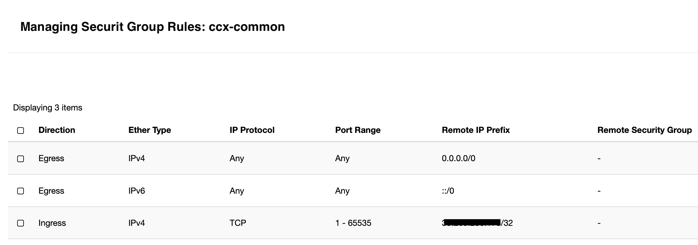

# Tutorial for OpenStack

*For laptop/desktop installation instructions please visit [Install CCX on a Laptop](CCX-Install-Laptop.md).*

In this tutorial, we will install CCX so it is accessible from a domain, which we will call `ccx.example.com`.

After completing this tutorial, you will have a working solution, but you will need to configure External DNS later.

OpenStack will be configured as the cloud provider.

## Requirements for Public Installation
- An OpenStack installation and an OpenStack project. Please note that Huawei's OpenStack implementation differs significantly and will use different endpoints.
- OpenStack credentials (e.g., an RC file)
- Ingress Controller. In this tutorial, we will use the NGINX Ingress Controller. The ingress controller must have an EXTERNAL-IP
- Domains (e.g., `ccx.example.com`, `cc.example.com`)
- Cert Manager

### Ingress Controller
You must have a working and correctly setup ingress controller. 

Make sure that you have ingress controller in your cluster and you are able to setup externally facing load balancers and that either your domain name points to the ingress IP or you have external DNS configured in your cluster.

By default, CCX is configured to use `nginx` as the ingress controller (`ingressClassName: nginx`).

```
kubectl get pods --all-namespaces -l app.kubernetes.io/name=ingress-nginx
```

The output should look like:

```
NAMESPACE       NAME                                        READY   STATUS    RESTARTS   AGE
ingress-nginx   ingress-nginx-controller-659f54cbff-fcszg   1/1     Running   0          5h38m
ingress-nginx   ingress-nginx-controller-659f54cbff-lq29d   1/1     Running   0          5h38m
```

All pods should be in a READY state, and STATUS should be Running.

Finally, check the external IP address of your NGINX Ingress Controller Load Balancer by running:

```
kubectl get svc -n ingress-nginx
```

The output should look like:

```
NAME                                 TYPE           CLUSTER-IP      EXTERNAL-IP                                 PORT(S)                      AGE
ingress-nginx-controller             LoadBalancer   10.108.22.0     146.190.177.145,2a03:b0c0:3:f0::9cb5:3000   80:31096/TCP,443:31148/TCP   5h40m
ingress-nginx-controller-admission   ClusterIP      10.108.28.137   <none>                                      443/TCP                      5h40m
ingress-nginx-controller-metrics     ClusterIP      10.108.13.85    <none>                                      9090/TCP                     5h40m
```

You must have an `EXTERNAL-IP`; otherwise, the installation will fail.

### Cert Manager
We recommend having cert-manager set up:

```
kubectl get pods -n cert-manager
```

Verify that the pods are running:

```
NAME                                       READY   STATUS    RESTARTS   AGE
cert-manager-66dbc9658d-4hh55              1/1     Running   0          11d
cert-manager-cainjector-69cfd4dbc9-lmxf2   1/1     Running   0          11d
cert-manager-webhook-5f454c484c-bx8gx      1/1     Running   0          11d
```

### Setup DNS
Ensure you have a DNS A record set up, pointing the EXTERNAL_IP to the domain you wish to install CCX on, e.g., `ccx.example.com`:

`A 146.190.177.145  ccx.example.com`


## Preparations

### Add Severalnines Helm Chart Repository

Setup the Helm repo:

```
helm repo add s9s https://severalnines.github.io/helm-charts/
helm repo update
```

The complete helm-charts are located on [GitHub](https://github.com/severalnines/helm-charts/tree/main/charts/ccx).

### Create a Namespace

We will deploy in a namespace called `ccx`:

```
kubectl create namespace ccx
kubectl config set-context --current --namespace=ccx
```

## Install CCX Dependencies

First, we need to install the CCX dependencies:

- PostgreSQL - [read more about the operator](./Postgres-Operator-Installation). In this tutorial, we will use the defaults.
- MySQL - [read more about the operator](./Mysql-Operator-Installation). In this tutorial, we will use the defaults.
- NATS
- VictoriaMetrics
- Loki
- Keycloak

### Installing the Dependencies
We will use the default values when setting up `ccxdeps`:

```
helm install ccxdeps s9s/ccxdeps --debug --wait -n ccx
```

Check that the pods are `RUNNING`:

```
kubectl get pods -n ccx
NAME                                         READY   STATUS    RESTARTS   AGE
acid-ccx-0                                   1/1     Running   0          7m13s
alertmanager-0                               1/1     Running   0          7m22s
ccxdeps-0                                    1/2     Running   0          67s
ccxdeps-ccx-nats-0                           3/3     Running   0          7m22s
ccxdeps-ccx-nats-box-c777b9b98-thhfs         1/1     Running   0          7m22s
ccxdeps-keycloak-0                           1/1     Running   0          7m22s
ccxdeps-loki-0                               1/1     Running   0          7m22s
ccxdeps-loki-gateway-56c8f56c6b-kw9s8        1/1     Running   0          7m22s
ccxdeps-postgres-operator-6847687666-79x8l   1/1     Running   0          7m22s
mysql-operator-5876cf5b66-6knkp              1/1     Running   0          27s
victoria-metrics-845694c98d-24wng            1/1     Running   0          7m22s
victoria-metrics-alert-7f695bf5c8-96ch5      1/1     Running   0          7m22s
```

:::note

If the mysql-operator pod fails to start with the error (use `kubectl logs mysql-operator-5876cf5b66-6knkp` to check):

```
persists try setting MYSQL_OPERATOR_K8S_CLUSTER_DOMAIN via environment
```

Then do:

```
kubectl edit deployment -n ccx mysql-operator
```

Locate the `env` section and set:

```yaml
env:
  - name: MYSQL_OPERATOR_K8S_CLUSTER_DOMAIN
    value: "cluster.local"
```

Finally, restart:

```
kubectl rollout restart deployment -n ccx mysql-operator
```

:::

## Configuring Cloud Credentials in K8s Secrets
In order to configure CCX for Opebstack you will need to provide cloud credentials.
Cloud credentials should be created as Kubernetes secrets in the format specified in [secrets-template-openstack.yaml](https://github.com/severalnines/helm-charts/blob/main/charts/ccx/secrets-template-openstack.yaml). The template looks like this:

```
---
apiVersion: v1
kind: Secret
metadata:
  name: openstack
type: Opaque
stringData:
  MYCLOUD_AUTH_URL: YOUR
  MYCLOUD_PASSWORD: OPENSTACK
  MYCLOUD_PROJECT_ID: CREDENTIALS
  MYCLOUD_USER_DOMAIN: HERE
  MYCLOUD_USERNAME: AND_HERE
  MYCLOUD_USER_DOMAIN_NAME: AND_HERE # duplicates USER_DOMAIN
---
apiVersion: v1
kind: Secret
metadata:
  name: openstack-s3
type: Opaque
stringData:
  MYCLOUD_S3_ENDPOINT: CHANGE_ME
  MYCLOUD_S3_ACCESSKEY: CHANGE_ME
  MYCLOUD_S3_SECRETKEY: CHANGE_ME
  MYCLOUD_S3_BUCKETNAME: CHANGE_ME
  MYCLOUD_S3_INSECURE_SSL: false #'true' or 'false'
```

:::important
The secrets contain a number of fields starting with `MYCLOUD`. This must be replaced with how you want to identify your cloud.

If you want to identifty the cloud as `grok`, then replace `MYCLOUD` with `grok` in the `openstack-secrets.yaml` file and make sure you use `grok` in the `minimal-values.yaml` file referenced later in this tutorial.
:::

 Make sure you have your OpenStack RC file handy as it contains the information you need. Also ensure you have S3 credentials. S3 will be used to store backup data coming from the datastores the end user deploys.

 Fill out the details, and save the file as `openstack-secrets.yaml`, and then run:

```
 kubectl apply -n ccx -f openstack-secrets.yaml
```

### Configure secrets using a script

You can also use the script [create-openstack-secrets.sh](https://github.com/severalnines/helm-charts/tree/main/charts/ccx/scripts) which will prompt you to enter the OpenStack credentials. It will create the credentials base64 encoded.
Download the scripts:

```
curl -o create-openstack-secrets.sh https://raw.githubusercontent.com/severalnines/helm-charts/main/charts/ccx/scripts/create-openstack-secrets.sh
curl -o create-openstack-s3-secrets.sh https://raw.githubusercontent.com/severalnines/helm-charts/main/charts/ccx/scripts/create-openstack-s3-secrets.sh
chmod u+x create-openstack-secrets.sh
chmod u+x create-openstack-s3-secrets.sh
```

Now run the scripts and enter the details:

```
./create-openstack-secrets.sh
```

and to generate credentials for S3:

```
./create-openstack-s3-secrets.sh
```

Apply the generated secrets files:

```
kubectl apply -n ccx -f openstack-secrets.yaml
kubectl apply -n ccx -f openstack-s3-secrets.yaml
```

### Verify the secrets

Verify that the secrets are created:

```
kubectl get secrets -n ccx
```

:::important
The secrets contain a number of fields starting with `MYCLOUD`.
This identifier `MYCLOUD` must match the name `- code: mycloud` and `mycloud:` in your configuration.

Thus, if you have a cloud called `grok`, then replace `MYCLOUD` with `grok` in the `openstack-secrets.yaml` and `openstack-s3-secrets.yaml` files and make sure you use `grok` in the `minimal-values.yaml` file referenced later in this tutorial.
:::

### Create Security Group ccx-common

You must also create a security group. Let's call it `ccx-common`.

`ccx-common` must allow all TCP traffic from all k8s nodes where CCX is running. The Egress must also be allowed. Below is a screenshot showing the `ccx-common`. The EXTERNAL-IP is specified for the port range 1-65535.



## Prepare the OpenStack Values File and OpenStack

We will use a [minimal OpenStack configuration](https://github.com/severalnines/helm-charts/blob/main/charts/ccx/minimal-values-openstack.yaml) as the template.
At this stage, you must have the following information/resources created in your OpenStack project:

- `floating_network_id` - this is the public network (public IP pool).
- `network_id` - this is the private network. You must create this in Openstack.
- `project_id` - the project_id where the resources will be deployed, This is your openstack project id. All resources are deployed in the same Openstack project.
- `image_id` (this image must be Ubuntu 22.04 of a recent patch level). Cloud-init will install the necessary tools on the image.
- instance type (a code for the instance type you will use, e.g., `x4.2c4m.100g`). We recommend 2vCPU and 4GB as the minimum instance type.
- volume type (a code for the volume type you will use, e.g., `fastdisk`).
- region, e.g., you need to know the name of the region, e.g., `nova` or `sto1` .
- the `ccx-common` security group.

Download the minimal values file:

```
curl -o minimal-openstack.yaml https://raw.githubusercontent.com/severalnines/helm-charts/main/charts/ccx/minimal-values-openstack.yaml
```

Edit the `minimal-openstack.yaml` and replace all `MY_*` with the values for `floating_network_id`, `network_id`, etc. Double-check that you do not omit or make any typos.
Also, ensure that instance types and volume types are specified.

### Sample Minimal OpenStack Values File
Below is an example. Please note that you can add more instance types, volume types, clouds, etc. We recommend starting small and expanding the configuration.

```yaml
ccx:
  # List of Kubernetes secrets containing cloud credentials.
  cidr: 0.0.0.0/0
  cloudSecrets:
    - openstack  # This secret must exist in Kubernetes. See 'secrets-template.yaml' for reference.
    - openstack-s3
  config:
    clouds:
      - code: mycloud  # Unique code for your cloud provider
        name: MyCloud  # Human-readable name
        instance_types:
          - code: x4.2c4m.100g
            cpu: 2
            disk_size: 100
            name: x4.2c4m.100g
            ram: 4
            type: x4.2c4m.100g
        volume_types:
        - code: fastdisk
          has_iops: false
          info: Optimized for performance
          name: Fast storage
          size:
            default: 60 # we recommend 100GB as minimum for production systems.
            max: 1000
            min: 30
        network_types:
          - code: public
            name: Public
            in_vpc: false
            info: >
              All instances will be deployed with public IPs.
              Access to the public IPs is controlled by a firewall.
        regions:
          - code: sto1  # this is your region code. 
            display_code: my-region1
            name: Stockholm
            city: Stockholm
            country_code: SE
            continent_code: EU
            availability_zones:
              - code: nova
                name: az1
  services:
    deployer:
      config:
        openstack_vendors:
          mycloud:
            compute_api_microversion: "2.79"
            floating_network_id: b19680b3-c00e-40f0-ad77-4448e81ae226  # Replace with actual ID
            network_api_version: NetworkNeutron
            network_id: 21dfbb3d-a948-449b-b727-5fdda2026b45  # Replace with actual network ID
            project_id: 5b8e951e41f34b5394bb7cf7992a95de  # Replace with your OpenStack project ID
            regions:
              sto1:  # region id, must be consistently set/named.
                image_id: 936c8ba7-343a-4172-8eab-86dda97f12c5  # Replace with image ID for the region
                # secgrp_name refers to the security group name used by CCX to access datastore VMs.
                # It must be created manually and allow all TCP traffic from all Kubernetes nodes where CCX is running.
                secgrp_name: ccx-common  # Recommended to use a dedicated security group
```

## Install CCX
Now it is finally time to install CCX:

```
helm upgrade --install ccx s9s/ccx --debug --wait --set ccxFQDN=ccx.example.com --set 'ccx.cidr=0.0.0.0/0' -f minimal-openstack.yaml
```

Wait for it to finish, and check that the pods are `RUNNING`:

```
kubectl get pods -n ccx
```

## CCX Web UI

Open `https://ccx.example.com/auth/register?from=ccx` in a web browser and register a new user. Please note that email notifications are not yet configured. You can just press the `Back` button after the signup.

Try to deploy a datastore. If it fails at around 8% or 16%, then there is a problem with the infrastructure. See the troubleshooting section below for clues.

## Basic Troubleshooting

During the creation of a datastore, several resources are set up: Security groups, volumes, networks, and instances.
If you run into issues, a good place to start is to look at logs from the `ccx-runner-service-NNN` pod:

```
kubectl logs ccx-runner-service-NNNN
```

### Timeouts

If you see issues with timeouts:
- Ensure you have updated the `ccx-common` security group with the correct IP address (the EXTERNAL-IP), but you might also need to add the IPs of the nodes.

### Double-check that URLs in the secrets file are correct:

```
kubectl get secret openstack -o json | jq -r '.data | to_entries[] | "\(.key): \(.value | @base64d)"'
```

See our [Troubleshooting](docs/admin/Troubleshooting/Troubleshooting.md) section for more information.

## Next Steps

- Set up and configure ExternalDNS
- Configure Instances (VMs, storage, etc.)
- Add another cloud provider (OpenStack, CloudStack)
