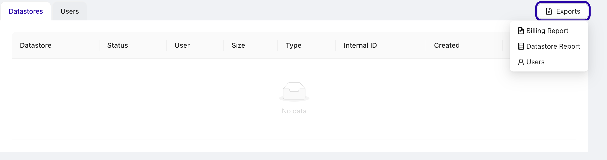
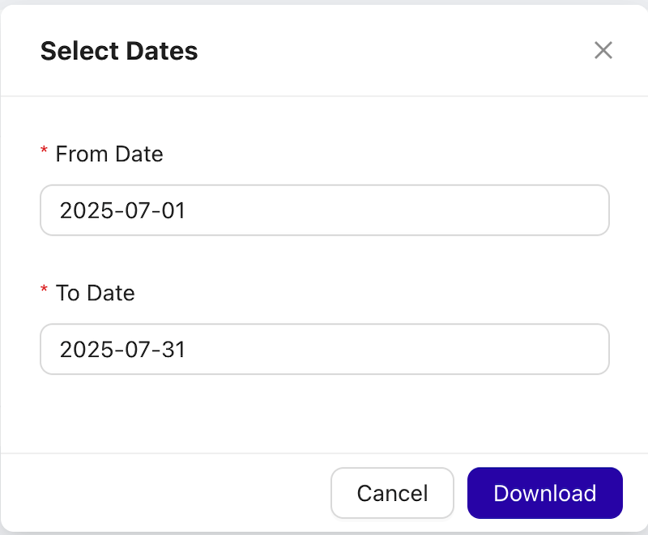

# Billing
This documentation outlines the functionality and usage of the billing report API that generates a JSON or CSV formatted report detailing all cluster usage within a specified date range. This report includes data from active and deleted clusters and is accessible only to admin users from the admin panel. 

Billing reports can be created using the billing API or from the admin UI.

Also see [Tagging](docs/admin/Other/Tagging.md).

## Admin UI

Navigate to `https://ccx.example.com/auth/admin/`.
Select Billing Report from the action menu, and a dialog opens allowing you to set start and stop date. Press Download to download the report (in CSV).





## Environment Variables

`RETENTION_PERIOD`: Defines how long the usage data for deleted clusters is kept (default is 6 months).

## API Endpoint

The endpoint is `https://ccx.example.com/api/admin/datastores/billing/{type}`

The reponse is either JSON or CSV.

### Authentication
Basic auth is supported. The credentials are stored in the `admin-basic-auth` secet.

### Method: GET

Parameters:

- `type`: `json` or `csv`
- `start`: Start date of the period (YYYY-MM-DD)
- `end`: End date of the period (YYYY-MM-DD)


#### Example Request

**JSON**
```
curl -uadmin:PASSWORD -X GET "https://ccx.example.com/api/admin/datastores/billing/json?start=2024-04-05&end=2024-04-05" 
```

Response Format:
```
{
  "datastores": [
    {
      "datastore": "string",
      "deleted_at": "string",
      "customer_id": "string",
      "type": "string",
      "nodes_count": 0,
      "vendor": "string",
      "instances_types_usage": [
        {
          "instances_type": "string",
          "hours": 0
        }
      ],
      "volumes_types_usage": [
        {
          "volume_type": "string",
          "average_gib": 0,
          "gib_per_hours": 0
        }
      ]
    }
  ],
  "network_egress_usage_gib": 0,
  "from": "string",
  "to": "string"
}
```

**CSV**

```
curl -uadmin:PASSWORD -X GET "https://ccx.example.com/api/admin/datastores/billing/csv?start=2024-04-05&end=2024-04-05" 
```


## Defining prices
Prices defined in the values.yaml file are not reflected in the billing report. 