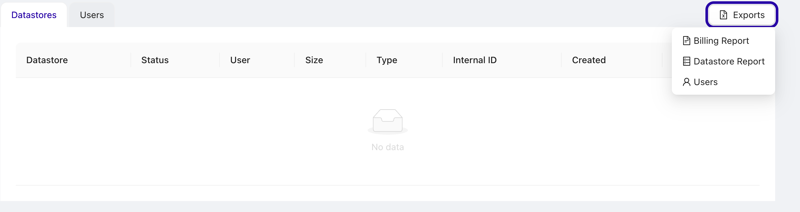
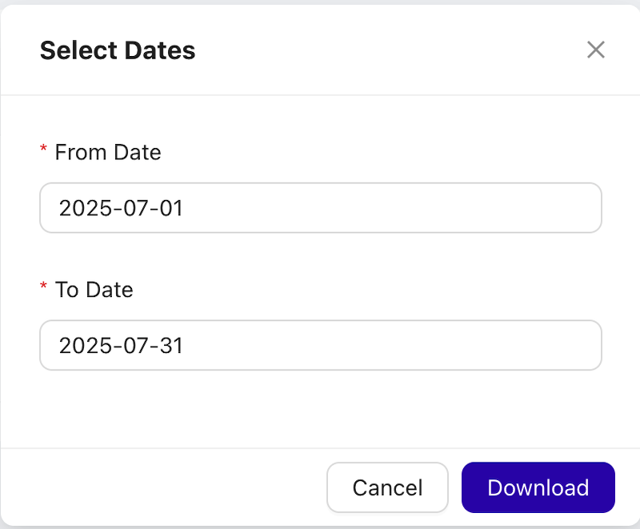

# Billing
This documentation outlines the functionality and usage of the billing report API that generates a JSON or CSV formatted report detailing all cluster usage within a specified date range. This report includes data from active and deleted clusters and is accessible only to admin users from the admin panel. 

Billing reports can be created using the billing API or from the admin UI.

Also see [Tagging](Tagging.md).

## Admin UI

Navigate to `https://ccx.example.com/auth/admin/`.
Select Billing Report from the action menu, and a dialog opens allowing you to set start and stop date. Press Download to download the report (in CSV).





## Environment Variables

`RETENTION_PERIOD`: Defines how long the usage data for deleted clusters is kept (default is 6 months).

## API Endpoint

The endpoint is `https://ccx.example.com/api/admin/datastores/billing/usage/{type}`

The reponse is either JSON or CSV.

### Authentication
Basic auth is supported. The credentials are stored in the `admin-basic-auth` secret:

```
kubectl get secret -n ccx admin-basic-auth -o jsonpath={.data.password} | base64 --decode
```

### Method: GET

Path parameters:

- `type`: `json` or `csv`

Query parameters:

- `from`: Start date of the period (`YYYY-MM-DD`). Optional. Inclusive — the window starts at `00:00` of this day. If omitted, the period has no lower bound (every cluster ever recorded is considered).
- `to`: End date of the period (`YYYY-MM-DD`). Optional. **Inclusive** — internally the server bumps it to `00:00` of the next day, so `to=2024-04-05` covers the full day of April 5. If omitted, the period extends to the end of the current day.

The server returns `400 Bad Request` if `to` is before `from` or if either date fails to parse.

#### How the period filter works

A cluster is included in the report if **its lifetime overlaps the requested window** — not just clusters created inside the window. Concretely, the server selects clusters where:

```
(deleted_at >= from OR deleted_at IS NULL) AND created_at < to + 1 day
```

So a report for `from=2024-04-01&to=2024-04-05` will also list a cluster that was created in March and deleted on April 3, because its lifetime intersects the window. The `created_at` and `deleted_at` fields on each datastore row are the cluster's actual lifecycle timestamps and can fall outside `[from, to]`.

Metrics (instance hours, volume GiB-hours, network egress, backups) are always computed for **the portion of the cluster's life that falls inside the window** — they never include usage from before `from` or after `to`.

#### The `from` / `to` fields in the response footer

These are **not** an echo of the request parameters. They describe the actual data window covered by the report:

- `from` — the earliest `created_at` among the clusters present in the report, but never earlier than the requested `from`. If the request had no `from`, this will be the creation date of the oldest cluster on the platform.
- `to` — the requested `to` if at least one cluster in the report is still alive (or if `to` was not specified, the moment the report was generated); otherwise the latest `deleted_at` among the listed clusters.

#### Example Request

**JSON**

```
curl -uadmin:PASSWORD -X GET "https://ccx.example.com/api/admin/datastores/billing/usage/json?from=2024-04-01&to=2024-04-05"
```

Response format:

```json
{
  "datastores": [
    {
      "datastore": "string",
      "created_at": "2024-04-01T10:00:00Z",
      "deleted_at": null,
      "customer_id": "string",
      "customer_reference": "string",
      "type": "string",
      "nodes_count": 0,
      "vendor": "string",
      "instances_types_usage": [
        {
          "instances_type": "string",
          "hours": 0
        }
      ],
      "volumes_types_usage": [
        {
          "volume_type": "string",
          "iops": 0,
          "iops_per_hour": 0,
          "gib_per_hours": 0,
          "average_gib": 0
        }
      ],
      "network_egress_usage_gib": 0,
      "backups": {
        "taken": 0,
        "taken_size_gib": 0,
        "removed": 0,
        "removed_size_gib": 0
      }
    }
  ],
  "from": "2024-04-01T00:00:00Z",
  "to": "2024-04-06T00:00:00Z"
}
```

Notes on the per-datastore fields:

- `created_at` / `deleted_at` — actual cluster lifecycle. `deleted_at` is `null` for clusters still alive at the end of the window.
- `customer_id` — the internal CCX user id that owns the cluster. Always present.
- `customer_reference` — the partner-side identifier for the cluster owner (the JWT `sub` claim recorded on first login for JWT-authenticated users on partner deployments). Use this to reconcile the report against the partner's own customer database. Omitted from the JSON for users that have no external identity recorded (non-JWT users / users created before JWT login was enabled).
- `instances_types_usage[].hours` — instance-hours within the window, aggregated per instance type.
- `volumes_types_usage[]` — per `(volume type, IOPS)` pair within the window. `gib_per_hours` is the GiB·hour integral; `average_gib` is the time-weighted average size; `iops_per_hour` is IOPS·hours.
- `network_egress_usage_gib` — egress (GiB) recorded for this cluster within the window.
- `backups` — number and total GiB of backups taken / removed within the window.

**CSV**

```
curl -uadmin:PASSWORD -X GET "https://ccx.example.com/api/admin/datastores/billing/usage/csv?from=2024-04-01&to=2024-04-05"
```

The CSV variant has the same data with one row per datastore; the response filename includes the resolved `from_to` range. The CSV header includes a `Customer Reference` column right after `Customer ID`; the cell is empty for users without a recorded external identity.


## Defining prices
Prices defined in the values.yaml file are not reflected in the billing report. 
