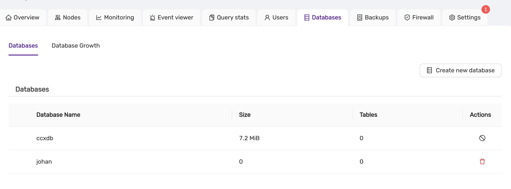
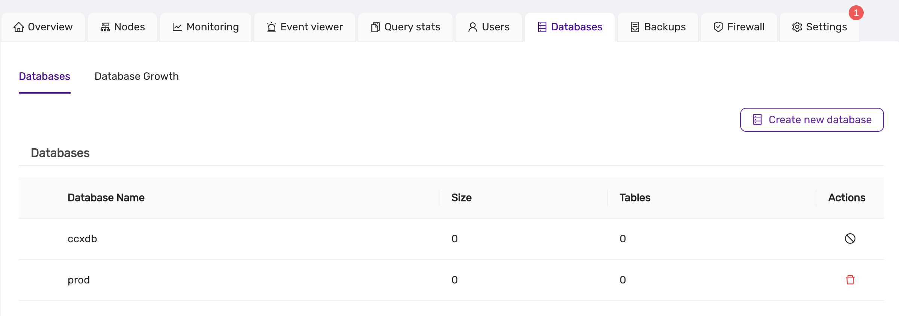
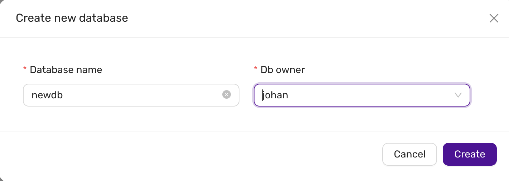
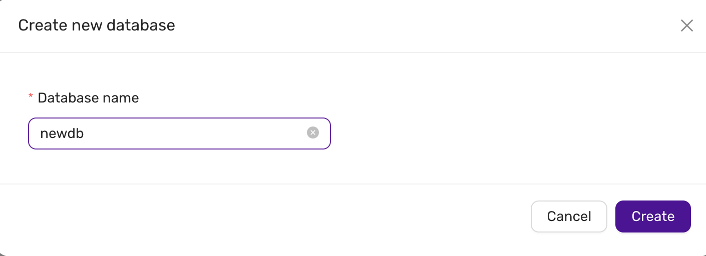
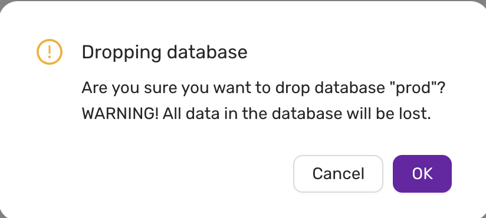

# Database Management

This guide explains how to create, list, and manage databases within the CCX platform for both PostgreSQL and MySQL systems.
Databases is not a concept in Redis, and in Microsoft SQLServer creating databases is not supported.

## Listing Existing Databases

Once databases are created, you can view the list of databases in the **Databases** tab.

- The **Database Name** column shows the names of the databases.
- The **Size** column displays the size of the database.
- The **Tables** column indicates the number of tables within each database.

- For MySQL, the database list will appear similar, with columns for database name, size, and tables.

## Creating a New Database

To create a new database in the CCX platform:

1. **Navigate to the Databases Tab:**
   - Click on the **Databases** section from the main dashboard.

2. **Click on Create New Database:**
   - A form will appear asking for the following details:
     - **Database Name:** The name of the new database.
     - **DB Owner:** The user who will own the database (applicable to PostgreSQL).

   

3. **Submit the Form:**
   - After filling in the necessary information, click **Create** to create the new database.

4. **MySQL Database Creation:**
   - For MySQL, the owner field is not required. You only need to specify the database name.

   

## Dropping a Database

To delete or drop a database:

1. **Locate the Database:**
   - In the **Databases** tab, find the database you want to delete.

2. **Click the Delete Icon:**
   - Click on the red delete icon next to the database entry.
   - A confirmation dialog will appear asking if you are sure about dropping the database.

   

3. **Confirm Deletion:**
   - Click **OK** to proceed. **WARNING:** All data in the database will be lost.

## Notes
- **PostgreSQL Database Owner:** When creating a database in PostgreSQL, ensure that a valid user is selected as the owner of the database.
- **MySQL Database Management:** MySQL database creation does not require specifying an owner, but all other functions (listing, deleting) remain similar.

