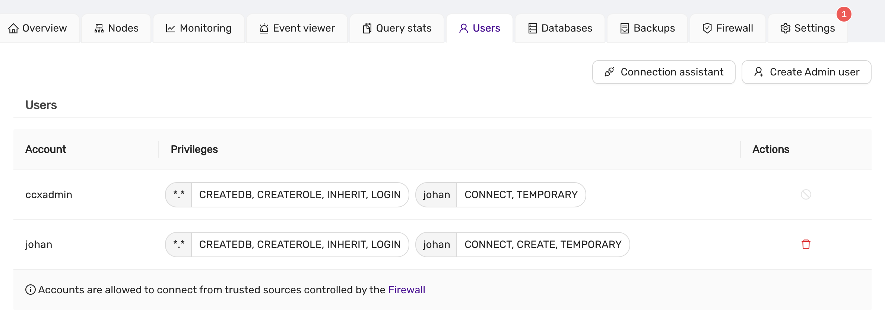
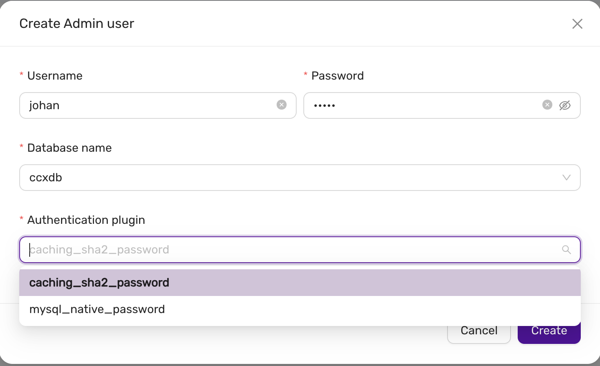
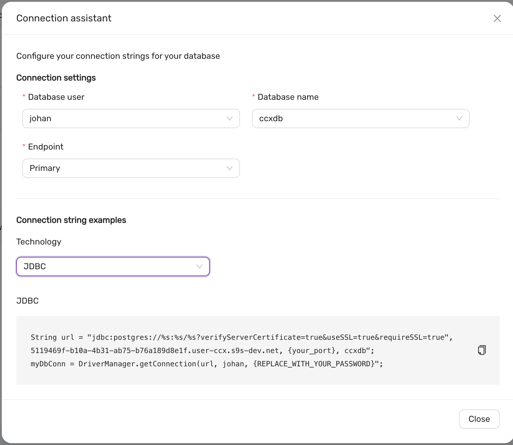

# Database User Management
CCX allows you to create admin users. These users can in turn be used to create database uses with lesser privileges.
Privileges and implementation is specific to the type of database. Admin users can be created for the following databases:
* PostgreSQL
* MySQL
* MariaDb
* Redis
* Microsoft SQL Server


## List database uses

To list database users do **Navigate to the Users Tab:**:

   

## Creating an Admin User

To create a new admin user, follow these steps:

1. **Navigate to Users Tab:**
   - Go to the **Users** section from the main dashboard.

2. **Click on Create Admin User:**
Below is the MySQL interface described, but the interface is similar for the other database types
   - A form will appear prompting you to enter the following details:
     - **Username:** Specify the username for the new admin.
     - **Password:** Enter a strong password for the admin user.
     - **Database Name:** Select or specify the database this user will be associated with.
     - **Authentication Plugin:** Choose the authentication method for the user. Available options:
       - `caching_sha2_password` (default)
       - `mysql_native_password` (for MySQL compatibility)

   

## Deleting a database user
**Delete User:** To delete a user, click on the red delete icon beside the user entry.
A confirmation dialog will appear before the user is removed.


## Connection assistant

CCX provides a **Connection Assistant** to help configure connection strings for your database clients.




1. **Configure Database User and Database Name:**
   - Select the database user and the database name.
   - Choose the **Endpoint** type (Primary or Replica).

2. **Connection String Generation:**
   - Based on the selected options, a connection string is generated for various technologies, including:
     - JDBC
     - ODBC
     - Python (psycopg2)
     - Node.js (pg)

3. **Example:**
   ```java
   String url = "jdbc:postgresql://<host>:<port>/<dbname>?verifyServerCertificate=true&useSSL=true&requireSSL=true";
   myDbConn = DriverManager.getConnection(url, "<username>", "<password>");
