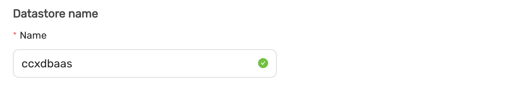
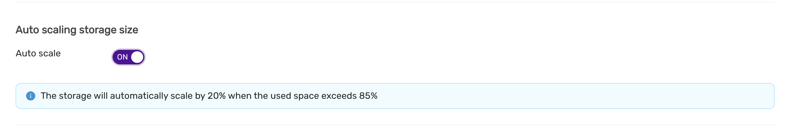
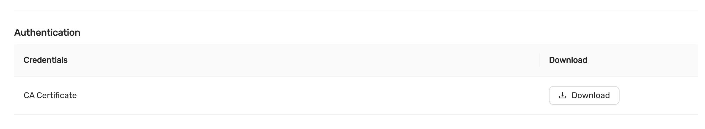

# Datastore Settings 

In the **Settings** section of CCX, there are two primary configuration options: **General** and **DB Parameters**.

The **General** settings section allows you to configure high-level settings for your datastore. This may include basic configurations such as system name, storage options, and general system behavior.

The **DB Parameters** section is used for fine-tuning your database. Here, you can adjust specific database settings such as memory allocation, query behavior, or performance-related parameters. These settings allow for a deeper level of control and optimization of the datastore for your specific workload.

## Database Parameters
Please see [Configuration management](Config-management).

## Changing the Datastore Name in CCX

The **Datastore Name** in CCX is an identifier for your datastore instance, and it is important for proper organization and management of multiple datastores. The name can be set when creating a datastore or changed later to better reflect its purpose or environment.

## Notifications in CCX
*Introduced in v.1.50.*

The **Notifications** feature in CCX allows you to configure email alerts for important system events. These notifications help ensure that you are aware of critical events happening within your environment, such as when the disk space usage exceeds a certain threshold or when important jobs are started on the datastore.

To configure recipients of notification emails, simply enter the email addresses in the provided field. Multiple recipients can be added by separating each email with a semicolon (`;`). 

If no email addresses are added, notifications will be disabled.

### Key Notifications:
- **Disk Space Alerts:** When disk usage exceeds **85%**, a notification is sent to the configured recipients.
- **Job Alerts:** Notifications are sent when significant jobs (such as data processing or backups) are initiated on the datastore.

This feature ensures that system administrators and key stakeholders are always up-to-date with the health and operations of the system, reducing the risk of unexpected issues.

## Auto Scaling Storage Size in CCX
*Introduced in v.1.50.*

CCX provides a convenient **Auto Scaling Storage Size** feature that ensures your system never runs out of storage capacity unexpectedly. By enabling this feature, users can automatically scale storage based on usage, optimizing space management. 

When **Auto Scale** is turned **ON**, the system will automatically increase the storage size by **20%** when the used space exceeds **85%** of the allocated storage. This proactive scaling ensures that your system maintains sufficient space for operations, preventing service interruptions due to storage constraints.

### Key Benefits:
- **Automatic scaling** by 20% when usage exceeds 85%.
- Ensures consistent performance and reliability.
- Eliminates the need for manual storage interventions.

This feature is especially useful for dynamic environments where storage usage can rapidly change, allowing for seamless growth as your data expands.

## Authentication in CCX
*Introduced in v.1.49.*

The **Authentication** section in CCX allows users to download credentials and CA certificates, which are essential for securing communication between the system and external services or applications.

### Credentials
The **Credentials** download provides the necessary authentication details, such as API keys, tokens, or certificates, that are used to authenticate your system when connecting to external services or accessing certain system resources. These credentials should be securely stored and used only by authorized personnel.

To download the credentials, simply click the **Download** button.

### CA Certificate
The **CA Certificate** ensures secure communication by verifying the identity of external systems or services through a trusted Certificate Authority (CA). This certificate is critical when establishing secure connections like HTTPS or mutual TLS (mTLS).

To download the CA Certificate, click the **Download** button next to the **CA Certificate** section.

### Security Considerations:
- **Keep credentials secure**: After downloading, ensure the credentials and certificates are stored in a secure location and only accessible by authorized personnel.
- **Use encryption**: Where possible, encrypt your credentials and certificates both at rest and in transit.
- **Regularly rotate credentials**: To maintain security, periodically rotate your credentials and update any related system configurations.

This **Authentication** section is vital for maintaining a secure and trustworthy communication environment in your CCX setup.
