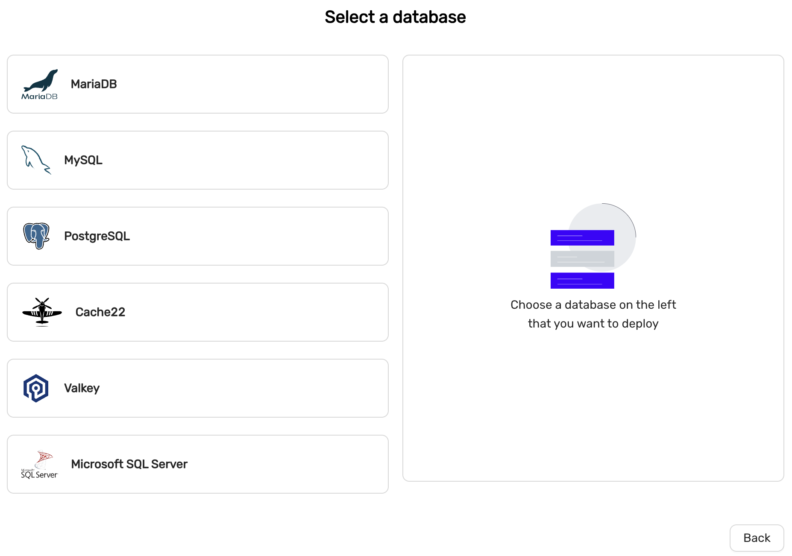

# Deploying a datastore

## MySQL or MariaDB
MySQL 8.4 is recommended if you are migrating from an existing MySQL system.
MariaDB 11.4 is recommended if you are migrating from an existing MariaDB system.
MySQL 8.4 offers a more sophisticated privilege system which makes database administration easier, wheres 

### High-availability
MySQL and MariaDB offers two configurations for High-availability.
* Primary/replica (asynchronous replication)
* Multi-primary (Galera replication)

Primary/replica is recommended for general purpose.

### Scaling
MySQL and MariaDb can be created with one node (no high-availability) and can later be scaled with read-replicas or Primarys (in case of Multi-primary configuration).

## PostgreSQL
PostgreSQL 15 and later supports the following extensions by default:
* PostGis
* PgVector
### High-availability
High-availability is facilitated with PostgreSQL streaming replication
### Scaling
PostgreSQL can be created with one node (no high-availability) but can later be scaled with read-replicas.

## Cache22 (aka Redis)
*deprecated* 

Cache22 is an in-memory data structure store.
### High-availability
High-availability is facilitated with Redis replication and Redis Sentinels.
### Scaling
Redis can be created with one node (no high-availability) but can later be scaled with read-replicas.

## Valkey
Valkey is an in-memory data structure store.
### High-availability
High-availability is facilitated with Valkey replication and Valkey Sentinels.
### Scaling
Valkey can be created with one node (no high-availability) but can later be scaled with read-replicas.

## MS SQLServer
Microsoft SQLServer 2022. Special license restrictions apply and this option may not be available in all CCX implementations.