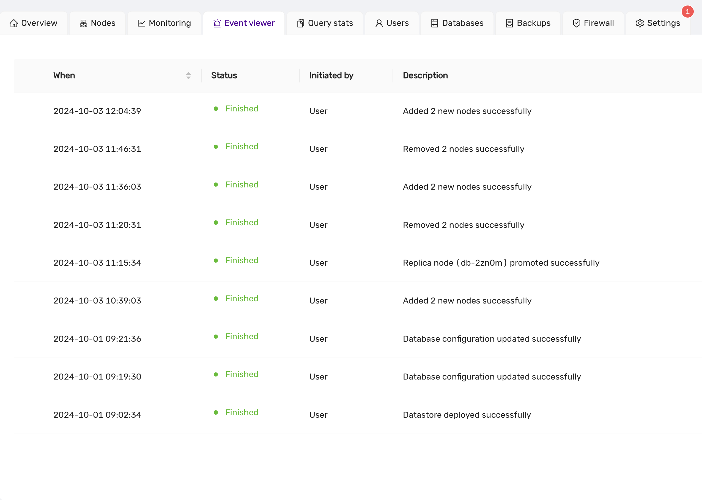

# Event Viewer

The **Event Viewer** provides a detailed history of actions performed on the datastore. It tracks when changes were made, their status, who initiated the action, and a brief description of the action itself.

## Event Viewer Columns:
- **When**: Timestamp indicating when the event occurred.
- **Status**: The current status of the event (e.g., `Finished` for successfully completed tasks).
- **Initiated by**: The user or process that initiated the action.
- **Description**: A summary of the action performed.

## Example Events:

The **Event Viewer** is essential for tracking the progress of tasks such as node scaling, promotions, and configuration updates. Each event is clearly labeled, providing users with transparency and insight into the state of their datastore operations.
