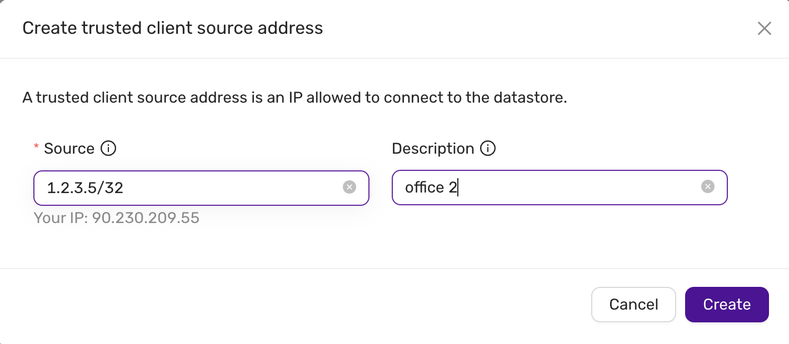

# Firewall Management
This guide explains how to manage trusted sources and open ports within the firewall settings of the CCX platform.
Only trusted sources are allowed to connect to the datastore.

A number of ports are open for each trusted source. One port is opened for the database service, but other ports are open for metrics.
This makes it possible to connect and scrape the database nodes for metrics from a trusted source. The metrics are served using Prometheus exporters.

## List Trusted Sources
Trusted sources can be managed from the **Firewall** tab. Only trusted sources are allowed to connect to the datastore.
. Here you can see:

- **Source:** View the allowed IP addresses or ranges.
- **Description:** Review the description of the source for identification.
- **Actions:** Delete the source by clicking on the red trash icon.

## Adding a Trusted Source

To allow connections from a specific IP address or range, you need to create a trusted source.

**Click on Create Trusted Source:**
   - A form will appear prompting you to enter the following details:
     - **Source IP:** Specify the IP address or CIDR range to allow.
     - **Description:** Add a description to identify the source (e.g., "My office", "Data Center").
   
   After filling out the details, click **Create** to add the trusted source.

## Viewing and Managing Trusted Sources

### Managing Open Ports for Each Trusted Source

Each trusted source can have specific ports opened for services. To manage the ports:

1. **Expand a Trusted Source:**
   - Click the down arrow beside the source IP to view the open ports.

2. **Port Configuration:**
   - **Port Number:** The number of the open port (e.g., `9100`, `5432`).
   - **Port Name:** The name of the service associated with the port (e.g., `node_exporter`, `postgres_exporter`, `service`).

   The `service` indicates the listening port of the database server. The ports for the `node_exporter` and `db_exporter` allows you to tap in to observability metrics for the database nodes.

3. **Actions:**
   - **Delete a Port:** Remove a port by clicking the red trash icon next to the port number.

### Example Ports:
- **Port 9100:** `node_exporter`
- **Port 9187:** `postgres_exporter`
- **Port 5432:** `service`

   

---

### Deleting Trusted Sources and Ports

#### Deleting a Trusted Source:
To remove a trusted source entirely, click on the red trash icon next to the source IP. This will remove the source and all associated ports.

#### Deleting an Individual Port:
To delete a specific port for a trusted source, click on the red trash icon next to the port number. This action will only remove the specific port.

---

This documentation covers the basic operations for managing firewall trusted sources and ports within the CCX platform. For further details, refer to the CCX platform's official user manual or support.
