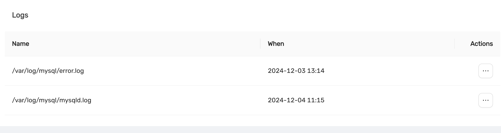

# Logs Viewer

The Logs Viewer provides a comprehensive view of Database logs. The generated logs can be accessed for troubleshooting. 
It provides real-time access to essential logs, such as error logs, slow query logs though UI.

## Logs Viewer Columns

- **Name**: The file path or identifier of the log file.
- **When**: The timestamp indicating the most recent update or entry in the log file.
- **Actions**: Options to view, download the log file for further analysis.

## Example Logs

---

The Logs Viewer is a critical tool for system administrators, enabling real-time monitoring and investigation of log files. With clear timestamps and actionable options, it ensures efficient identification and resolution of issues to maintain the stability of datastore operations.
