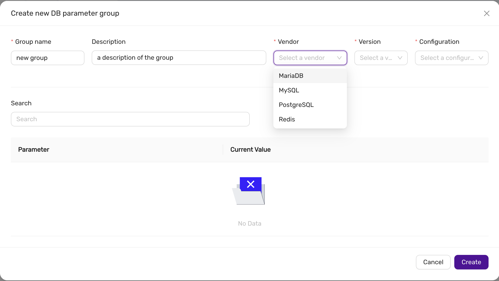
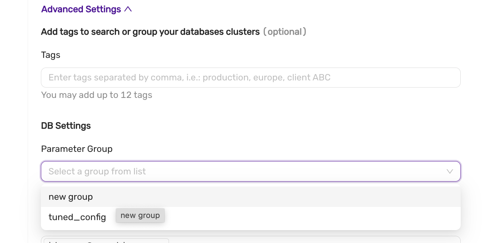
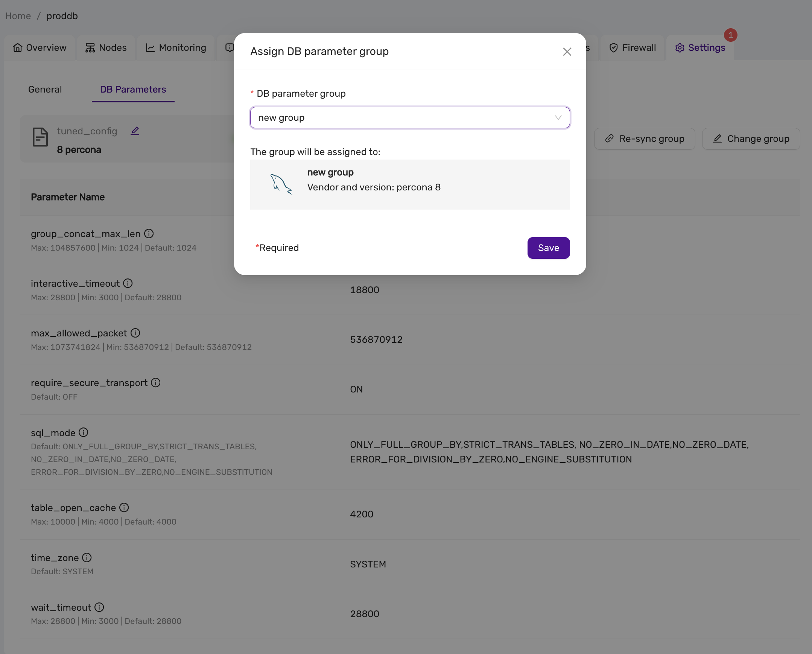
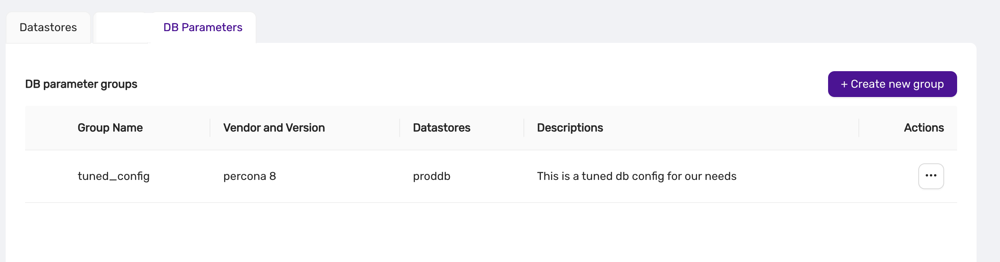
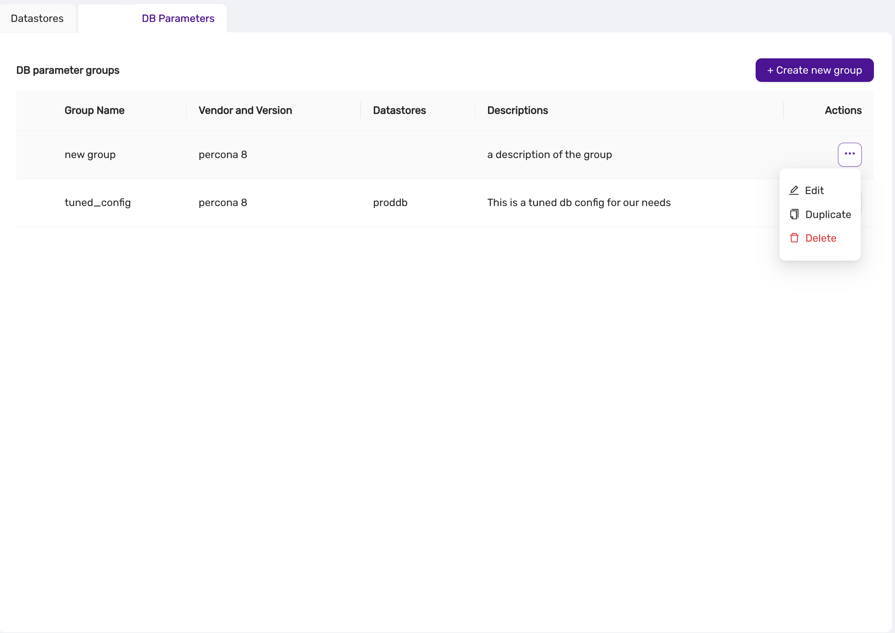
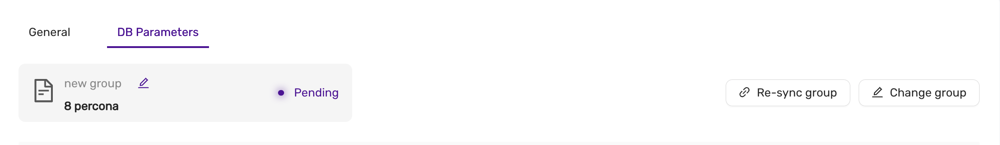

# Parameter Groups
*Introduced in v.1.51*

Parameter Groups is a powerful new feature introduced in version 1.51 of CCX. It enables users to manage and fine-tune database parameters within a group, simplifying configuration and ensuring consistency across datastores.

## Overview

With Parameter Groups, users can:

- Create new parameter groups with customized settings.
- Assign parameter groups to specific datastores.
- Edit and update parameters within a group.
- Delete unused parameter groups.
- Automatically synchronize parameter changes with associated datastores.

:::note
A datastore can only be associated with one parameter group at a time. Changes to parameters are automatically propagated to all associated datastores.
:::
---

## Features

### 1. Creating a Parameter Group

Users can create a new parameter group to define custom configurations for their databases.

**Steps to Create a New Parameter Group:**

1. Navigate to the **DB Parameters** section.
2. Click on the **+ Create new group** button.
3. Fill in the required details:
   - **Group Name**: A unique name for the parameter group.
   - **Description**: A brief description of the group.
   - **Vendor**: Select the database type (e.g., MySQL, PostgreSQL, Redis).
   - **Version**: Specify the database version.
   - **Configuration**: Choose the type of configuration (e.g., Primary/Replica).
4. Customize the parameter values as needed.
5. Click **Create** to save the new group.

---

### 2. Assigning a Parameter Group to a Datastore

Once created, parameter groups can be assigned to datastores to apply the defined settings.
The parameter can be assigned to an existing datastore or when a datastore is created.

**Steps to Assign a Parameter Group in the Deployment wizard:**
1. Open the Create datastore wizard
2. In the Configuration step, press Advanced, and select the parameter group under DB Settings. 

:::note 
Please note that atleast one parameter group must exist matching the vendor, version and configuration. 
:::

**Steps to Assign a Parameter Group to an existing datastore:**

1. Navigate to the datastore you want to configure.
2. Go to the **DB Parameters** tab.
3. Click **Change group** or **Assign group**.
4. Select the desired parameter group from the dropdown.
5. Click **Save** to apply the group to the datastore.

The system will display the synchronization status (e.g., Pending or Synced) after assigning the group.

---

### 3. Viewing and Managing Parameter Groups

Users can view all parameter groups in the **DB Parameters** section. For each group, the following details are displayed:

- **Group Name**
- **Vendor and Version**
- **Datastores**: Associated datastores.
- **Descriptions**

From this view, users can:

- **Edit**: Modify the group’s parameters.
- **Duplicate**: Create a copy of the group.
- **Delete**: Remove the group.

---

### 4. Editing a Parameter Group

Parameter groups can be updated to reflect new configurations. Any changes are automatically synchronized with associated datastores.

**Steps to Edit a Parameter Group:**

1. Navigate to the **DB Parameters** section.
2. Click on the three-dot menu next to the group you want to edit.
3. Select **Edit**.
4. Update the parameter values as needed.
5. Click **Save**.

---

### 5. Deleting a Parameter Group

Unused parameter groups can be deleted to maintain a clean configuration environment.

**Steps to Delete a Parameter Group:**

1. Navigate to the **DB Parameters** section.
2. Click on the three-dot menu next to the group you want to delete.
3. Select **Delete**.
4. Confirm the deletion.

:::note 
A parameter group cannot be deleted if it is assigned to a datastore.
:::
---

### 6. Synchronization

Once a parameter group is assigned to a datastore, the parameters are automatically synchronized. The status of synchronization (e.g., Pending or Synced) is visible in the **DB Parameters** tab of the datastore, and also in the Event Viewer.

---

## Best Practices

- **Use Descriptive Names**: Give parameter groups clear, descriptive names to make them easily identifiable.
- **Regular Updates**: Regularly review and update parameter groups to optimize database performance.
- **Monitor Sync Status**: Always verify that parameter changes are properly synced to the datastores.

---

## Conclusion

Parameter Groups in CCX provide a centralized and efficient way to manage database configurations. By grouping parameters and syncing them to datastores, users can ensure consistency, reduce manual errors, and improve overall system performance.