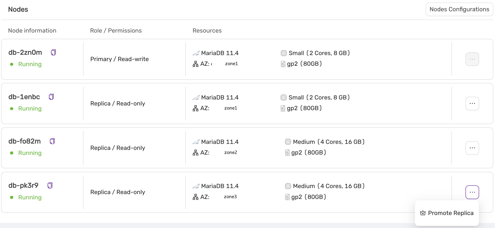

# Promoting a Replica to a New Primary

You may want to promote a replica to become the new primary. For instance, if you've scaled up with a larger instance, you might prefer to designate it as the primary. Alternatively, if you're scaling down, you may want to switch to a smaller configuration for the primary node.

In the **Nodes** view, select the **Promote Replica** action from the action menu next to the replica you wish to promote:

In this example, the replica with an instance size of 'medium' will be promoted to the new primary.

A final confirmation screen will appear, detailing the steps that will be performed:

