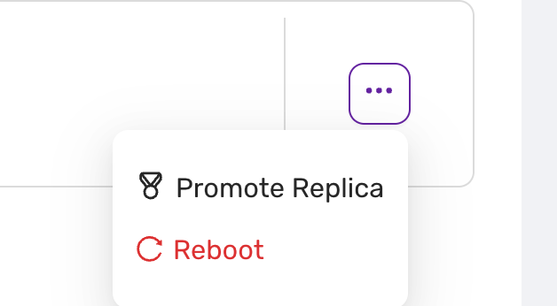

# Reboot database node
*Introduced in v.1.51*

The reboot command is found under the action menu of a databse node, on the Nodes page.

Selecting "Reboot" triggers a restart of the chosen replica. Use this option when:
- the replica needs to be refreshed due to performance issues
- for maintenance purposes. 
- For some parameters, any change to the parameter value in a parameter group only takes effect after a reboot.

:::danger
- Ensure all tasks linked with the node are concluded before initiating a reboot to prevent data loss.
- Only authorized personnel should perform actions within the administration panel to maintain system integrity.
::: 

:::note
- Please note that rebooting may cause temporary unavailability.
- In Valkey,  the primary may failover to a secondary if the reboot takes more than 30 seconds.
:::

