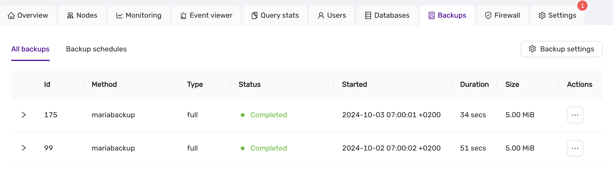
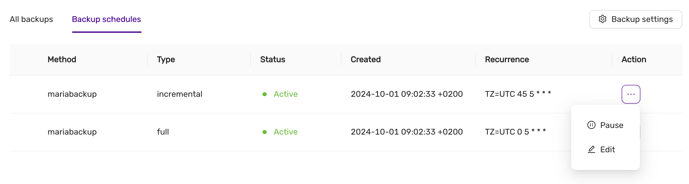
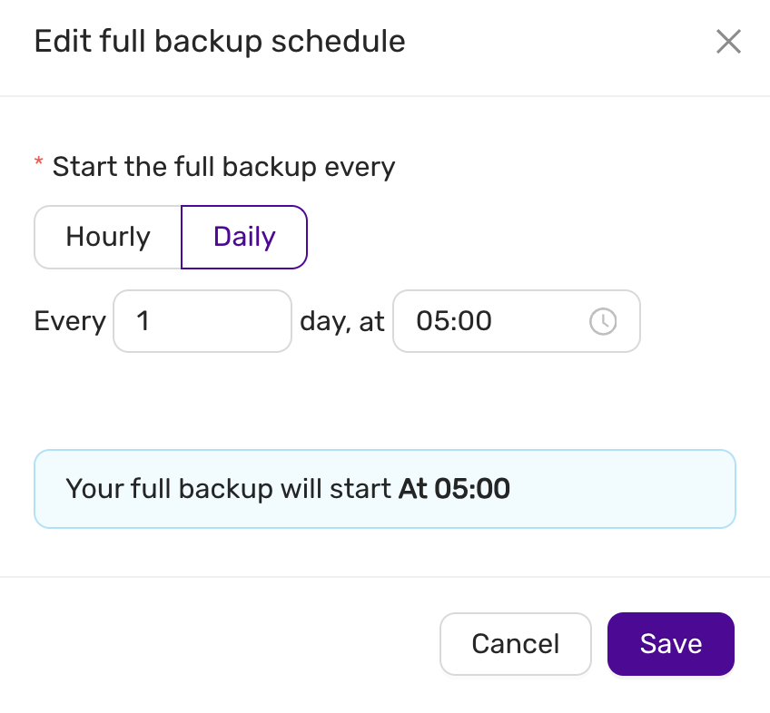
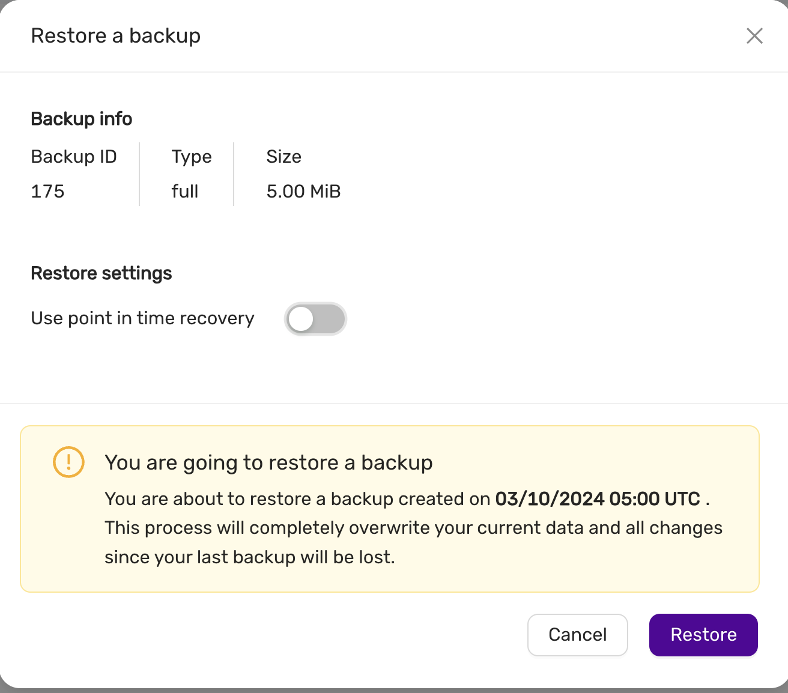

# Backup and Restore

The **Backup and Restore** feature provides users with the ability to create, view, and restore backups for their databases. This ensures data safety and allows recovery to previous states if necessary.

## Backup List View

In the **Backup** tab, users can view all the backups that have been created. The table provides essential information about each backup, such as:

- **Method**: The tool or service used to perform the backup (e.g., `mariabackup`).
- **Type**: The type of backup (e.g., full backup).
- **Status**: The current state of the backup (e.g., `Completed`).
- **Started**: The start time of the backup process.
- **Duration**: How long the backup process took.
- **Size**: The total size of the backup file.
- **Actions**: Options to manage or restore backups.

### Example Backup Table

Users can manage their backups using the "Actions" menu, where options such as restoring a backup are available.

## Backup Schedules View

The **Backup Schedules** allows users to manage scheduled backups for their datastore. Users can configure automatic backup schedules to ensure data is periodically saved without manual intervention.

### Backup Schedule Table

The schedule table shows the details of each scheduled backup, including:

- **Method**: The tool or service used to perform the backup (e.g., `mariabackup`).
- **Type**: The type of backup, such as `incremental` or `full`.
- **Status**: The current state of the scheduled backup (e.g., `Active`).
- **Created**: The date and time when the backup schedule was created.
- **Recurrence**: The schedule's frequency, showing the cron expression used for the schedule (e.g., `TZ=UTC 5 * * *`).
- **Action**: Options to manage the schedule, such as **Pause** or **Edit**.

### Example Backup Schedule Table:

### Managing Backup Schedules

The **Action** menu next to each schedule allows users to:

- **Pause**: Temporarily stop the backup schedule.
- **Edit**: Adjust the backup schedule settings, such as its frequency or time.

### Editing a Backup Schedule

When editing a backup schedule, users can specify:

- **Frequency**: Choose between `Hourly` or `Daily` backups.
- **Time**: Set the exact time when the backup will start (e.g., 05:00 UTC).

For example, in the **Edit Full Backup Schedule** dialog, you can configure a full backup to run every day at a specified time. Adjust the settings as needed and click **Save** to apply the changes.

### Example Backup Schedule Edit Dialog:

This dialog allows you to easily adjust backup intervals, ensuring that backups align with your operational needs.

:::note

Editing or pausing a schedule will not affect the current backups already created. The changes will only apply to future backups.

:::

## Restore Backup

To restore a backup, navigate to the **Backup** tab, find the desired backup, and select the **Restore** action from the **Actions** menu. This opens the restore dialog, where the following information is displayed:

- **Backup ID**: The unique identifier of the backup.
- **Type**: The type of backup (e.g., full backup).
- **Size**: The total size of the backup file.

### Restore Settings

- **Use Point in Time Recovery**: Option to enable point-in-time recovery for finer control over the restore process. PITR is only supported by Postgres, MySQL/MariaDb, and MS SQLServer.

By default, this option is turned off, allowing a full restoration from the selected backup.

### Confirmation

Before initiating the restore, users are presented with a confirmation dialog:

> **You are going to restore a backup**  
> You are about to restore a backup created on `03/10/2024 05:00 UTC`.  
> This process will completely overwrite your current data, and all changes since your last backup will be lost.

Users can then choose to either **Cancel** or proceed with the **Restore**.

### Example Restore Dialog:

This ensures that users are fully aware of the potential data loss before proceeding with the restore operation.
