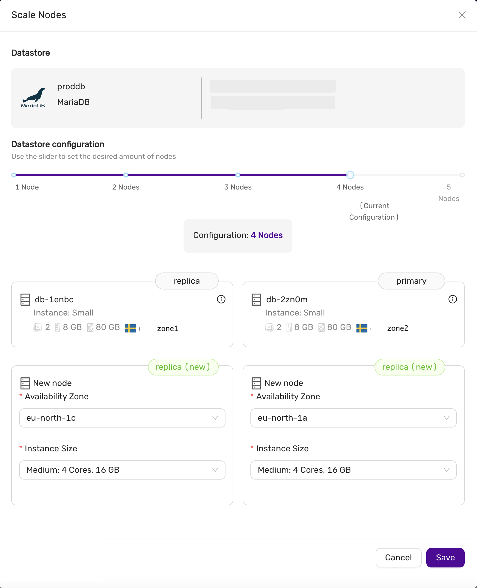

# Scaling a Datastore

This section explains how to scale a datastore, including:
* Scaling volumes
* Scaling nodes

## Scaling a Datastore

A datastore can be scaled out to meet growing demands. Scaling out involves adding:
* One or more replica nodes (for primary/replica configurations). This is useful when you need to scale up and want the primary node to have more resources, such as additional CPU cores and RAM.
* One or more primary nodes (for multi-primary configurations). In multi-primary setups, scaling up or down must maintain an odd number of nodes to preserve quorum and the consensus protocol required by the database.

The instance type of the new nodes may differ from the current ones.

To scale a datastore, navigate to the **Nodes** page and select **Nodes Configuration**.

## Scaling Up or Down, In or Out

Use the slider to adjust the datastore’s new size. In this example, we have two nodes (one primary and one replica), and we want to scale up to four nodes. You can also specify the availability zones and instance sizes for the new nodes. Later, you might choose to promote one of the replicas to be the new primary. To proceed with scaling, click **Save** and wait for the scaling job to complete.

### Scaling Down

You can also scale down by removing replicas or primary nodes (in a multi-primary configuration). In the **Nodes Configuration** view, select the nodes you wish to remove, then click **Save** to begin the scaling process. This allows you to reduce the size of the datastore or remove nodes with unwanted instance sizes.

## Scaling Volumes

To scale storage, go to the **Nodes** tab and select **Scale Storage**. You can extend the storage size, but it cannot be reduced. All nodes in the datastore will have their storage scaled to the new size.
