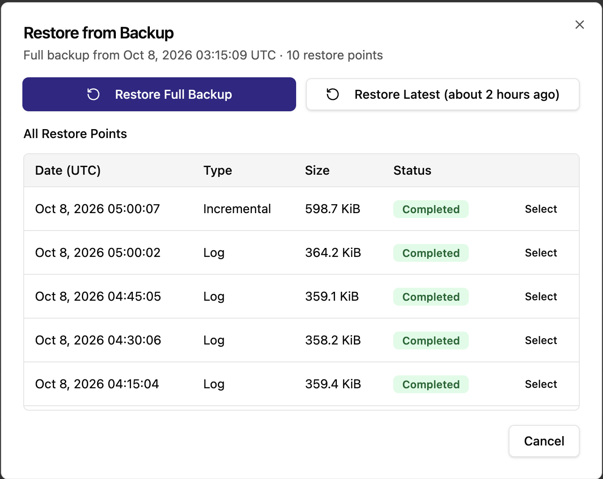

# Backup and Restore

CCX backs up Microsoft SQL Server with SQL Server's own native backup, streamed directly to S3 storage. Native S3 streaming was introduced in CCX 1.58.

## Backup

### How backups are taken

Backups use SQL Server's `BACKUP ... TO URL`, which writes the backup straight to S3 storage:

- Nothing is written to the database server's disk first, and there is no separate upload step. A backup is complete when SQL Server has finished writing it to S3.
- Every backup is compressed, encrypted (AES-256) and checksummed by SQL Server.
- Each database is written to its own object, so a backup of a datastore with several databases contains one file per database.
- In the Always On configuration, backups are taken on the primary. After a failover, backups continue on the new primary.

### Backup types and schedule

Three backup types are used together:

| Type | What it contains | Default schedule |
|---|---|---|
| Full | The complete database | Once a day |
| Differential (shown as "incremental" in the backup schedule) | Changes since the last full backup | Every hour |
| Log | The transaction log since the previous log backup | Every 15 minutes |

The log backups determine how much data can be lost: with the default schedule, there is normally a restore point about every 15 minutes.

The backup schedule can be tuned and backups can be paused.

### After a failover

The first backup taken on a new primary after a failover is always a full backup, even if a differential or log backup was scheduled. Normal scheduling continues after that.

### Deleting backups

When a backup is deleted, either manually or because it has passed the retention period, its files are removed from S3 storage.

## Restore

### Restore a backup on the existing datastore

Restoring starts from a full backup. The **Restore from Backup** dialog lists the full backup and every restore point taken after it: the differential backups (shown as *Incremental*) and the log backups.

- **Restore Full Backup** restores the full backup only.
- **Restore Latest** restores the newest restore point in the list.
- **Select** on a row restores up to that restore point.

CCX builds the sequence SQL Server needs to reach the chosen point and restores it on the primary:

- **Full backup:** the full backup only.
- **Differential backup:** the full backup, then the chosen differential backup.
- **Log backup:** the full backup, then the most recent differential backup taken after the full backup and before the chosen log backup (if there is one), then every log backup after that up to and including the chosen one.

Choosing a log backup restores the database to the moment that log backup was taken.

The backup files are read directly from S3 storage. In the Always On configuration, `ccxdb` is also restored on the replica and rejoined to the availability group, so it is highly available again when the restore finishes. Other user-created databases are not replicated; see [Limitations](./limitations.md).

Please note:

- A restore replaces the current contents of the restored databases. Data written after the chosen backup is lost.
- The databases are unavailable to applications while the restore runs.
- Backups taken before a failover can be restored after it, on the new primary.

### Backups taken before CCX 1.58

Backups taken before CCX 1.58 (written to disk first and then uploaded) can still be restored. CCX downloads them to the primary before restoring them. A restore sequence may mix both kinds, for example an older full backup followed by newer differential and log backups.

## Limitations

- **Backups taken right after a restore.** Differential and log backups taken between a restore and the next scheduled full backup may not be restorable. With the default schedule this window lasts until the next daily full backup. Backups taken before the restore, and backups taken after the next full backup, are not affected.
