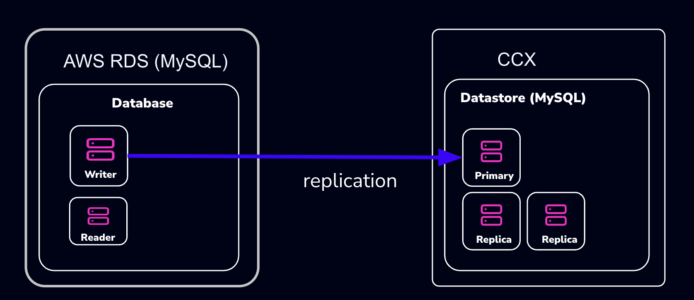

# Importing data from Amazon RDS

This procedure describes how to import data from Amazon RDS to a MySQL datastore located in CCX.

- The MySQL Datastore on CCX is denoted as the 'CCX Primary'
- The RDS Source of the data is denoted as the 'RDS Writer'



Schematically, what we will setup is this:
:::warning
AWS RDS tries to make it as hard as possible to migrate away from. Many procedures on the internet, as well as AWS own procedures will not work. 

The migration we suggest here (and is the only one we know works) requires that the RDS Writer instance is blocked for writes until a mysqldump has been completed. However, AWS RDS blocks operatios such as `FLUSH TABLES WITH READ LOCK`:
`mysqldump: Couldn't execute 'FLUSH TABLES WITH READ LOCK': Access denied for user 'admin'@'%' (using password: YES) (1045)`
Thus, the actual applications must be blocked from writing.

Also, some procedures on the internet suggests creating a read-replica. This will not work either, as the AWS RDS Read-replica is crippled and lacks GTID support.
:::

:::note
If you dont want to setup replication, then you can chose to only apply the sections:
* Create a database dump file of the RDS Writer
* Apply the dumpfile on the CCX replica
:::

## Preparations
* Create a datastore on CCX. Please note that you can also replicate from MySQL 8.0 to MySQL 8.4.
* Get the endpoint of the CCX Primary (under the Nodes section).   . Then endpoint in our case is `db-9bq15.471ed518-8524-4f37-a3b2-136c68ed3aa6.user-ccx.mydbservice.net`.
* Get the endpoint of the RDS Writer. In this example, the endpoint is `database-1.cluster-cqc4xehkpymd.eu-north-1.rds.amazonaws.com`
* Update the Security group on AWS RDS to allow the IP address of the CCX Primary to connect. To get the IP address of the CCX Primary you do:
        ```
        dig db-9bq15.471ed518-8524-4f37-a3b2-136c68ed3aa6.user-ccx.mydbservice.net
* Ensure you can connect a mysql client to both the CCX Primary and the RDS Writer.        ```

## Create a replication user on the RDS Writer instance:
Create a replication user with sufficient privileges on the RDS Writer. 
In the steps below, we will use `repl` and `replpassword` as the credentials when setting up the replica on CCX.

```
CREATE USER 'repl'@'%' IDENTIFIED BY 'replpassword';
GRANT REPLICATION SLAVE ON *.* TO  'repluser'@'%'; #mysql 8.0
GRANT REPLICATION REPLICATION_SLAVE_ADMIN ON *.* TO  'repluser'@'%';
```

## Block Writes to the RDS Writer Instance
This is the hardest part. You must ensure your applications cannot write to the Writer instance.
Unfortunately, AWS RDS blocks operations like `FLUSH TABLES WITH READ LOCK`. 

## Create a consistent dump
Assuming now that writes are blocked on the RDS Writer Instance, you must now get the binary log file and the position of the RDS Writer instancde.

### Get the replication start position
The start position (binary log file name, and position) is used to tell the replica where to start replicating data from. 
```
MySQL 8.0: SHOW MASTER STATUS\G 
MySQL 8.4 and later: SHOW BINARY LOG STATUS\G
```
It will output:
```
 *************************** 1. row ***************************
             File: mysql-bin-changelog.000901
         Position: 584
     Binlog_Do_DB:
 Binlog_Ignore_DB:
Executed_Gtid_Set: 796aacf3-24ed-11f0-949d-0605a27ab4b9:1-876
1 row in set (0.02 sec)
```
Record the `File: mysql-bin-changelog.000901` and the `Position: 584` as they will be used to setup replication form.

### Create the mysqldump 
Be sure to specify the database you wish to replicate. You must omit any system databases. In this example we will dump the databases `prod` and `crm`.
```
mysqldump -uadmin -p   -hdatabase-1.cluster-cqc4xehkpymd.eu-north-1.rds.amazonaws.com  --databases prod crm  --triggers --routines --events  --set-gtid_purged=OFF --single-transaction  > dump.sql
```
Wait for it to complete.

## Unblock Writes to the RDS Writer Instance
At this stage it is safe to enable application writes again.

## Load the dump on the replica

### Create a replication filter on the replica
The replica filter prevents corruption of the datastore and we are not interested in changes logged by AWS RDS to mysql.rds* tables anyways. Also add other databases that you do not wish to replicae to the filter.
:::note 
If the CCX datastore's system tables are corrupted using replication then the datastore must be recreated.
:::
```
CHANGE REPLICATION FILTER REPLICATE_IGNORE_DB=(mysql, sys, performance_schema);
```

Important! If your database dump contains SPROCs, triggers or events, then you must replace DEFINER:

```
sed 's/\sDEFINER=`[^`]*`@`[^`]*`//g' -i dump.sql
```

### Apply the dumpfile on the CCX Primary:
```
cat dump.sql | mysql -uccxadmin -p -hCCX_PRIMARY
```

## Connect the CCX Primary to the RDS Writer Instance
The CCX Primary must be instructed to replicate from the RDS Writer. We have from the earlier step binlog file and position:
- mysql-bin-changelog.000901
- 584

```
CHANGE REPLICATION SOURCE TO SOURCE_HOST='database-1.cluster-cqc4xehkpymd.eu-north-1.rds.amazonaws.com', SOURCE_PORT=3306, SOURCE_USER='repl', SOURCE_PASSWORD='replpassword', SOURCE_SSL=1, SOURCE_LOG_FILE='mysql-bin-changelog.000901', SOURCE_LOG_POS=584;
```

### Start the replica
On the replica do:
```
START REPLICA;
```
followed by:
```
SHOW REPLICA STATUS;
```
And verify that:
```
             Replica_IO_State: Waiting for source to send event
	     ..
  	     Replica_IO_Running: Yes
             Replica_SQL_Running: Yes
```	     
### When the migration is ready
At some stage you will need to point your applications to the new datastore. Ensure:
* Prevent writes to the RDS Writer.
* Make sure the CCX Primary has applied all data (use `SHOW REPLICA STATUS`)
* Connect the applications to the new datastore.
```
STOP REPLICA;
RESET REPLICA ALL;
CHANGE REPLICATION FILTER REPLICATE_IGNORE_DB=();
```

### Troubleshooting
If the replication fails to start then verify:
* All the steps above has been followed.
* Ensure that the IP address of the  CCX Primary is added to the security group used by the RDS Writer instance.
* Ensure that you have the correct IP/FQDN of the RDS Writer instance.
* Ensure that users are created correctly and using the correct password.
* Ensure that the dump is fresh.


