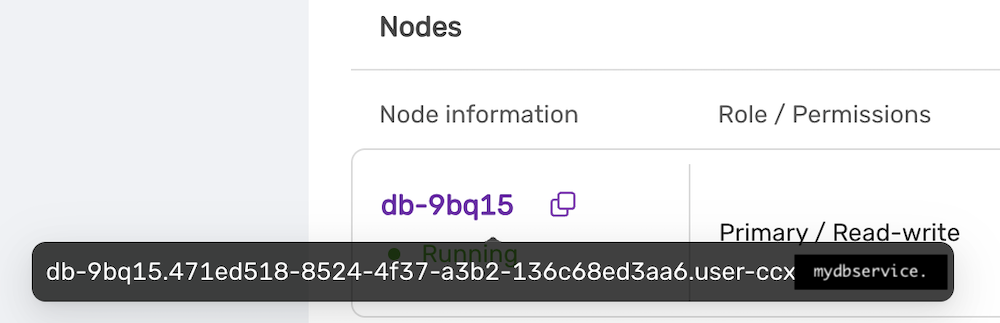

# Importing data from Google Cloud SQL

This procedure describes how to import data from Google Cloud SQL to a MySQL datastore located in CCX.

- The MySQL Datastore on CCX is denoted as the 'CCX Primary'
- The GCP Source of the data is denoted as the 'GCP Primary'

Schematically, what we will setup is this:


:::note

If you dont want to setup replication, then you can chose to only apply the sections:

- Create a database dump file of the GCP Primary.
- Apply the dumpfile on the CCX replica.

:::

## Preparations

- Create a datastore on CCX. Please note that you can also replicate from MySQL 8.0 to MySQL 8.4.
- Get the endpoint of the CCX Primary (under the Nodes section).  . Then endpoint in our case is `db-9bq15.471ed518-8524-4f37-a3b2-136c68ed3aa6.user-ccx.mydbservice.net`.
- The GCP Primary must have a Public IP.
- Get the endpoint of the GCP Primary. In this example, the endpoint is `34.51.xxx.xxx`
- Update the Security group on AWS RDS to allow the IP address of the CCX Primary to connect. To get the IP address of the CCX Primary you do:
    ```
    dig db-9bq15.471ed518-8524-4f37-a3b2-136c68ed3aa6.user-ccx.mydbservice.net
    ```
- Ensure you can connect a mysql client to both the CCX Primary and the RDS Writer.

## Create a replication user on the GCP Primary instance

Create a replication user with sufficient privileges on the RDS Writer.
In the steps below, we will use `repl` and `replpassword` as the credentials when setting up the replica on CCX.

```sql
CREATE USER 'repl'@'%' IDENTIFIED BY 'replpassword';
GRANT REPLICATION SLAVE ON *.* TO  'repluser'@'%'; #mysql 8.0
GRANT REPLICATION REPLICATION_SLAVE_ADMIN ON *.* TO  'repluser'@'%';
```

### Create the mysqldump

Be sure to specify the database you wish to replicate. You must omit any system databases. In this example we will dump the databases `prod` and `crm`.

```bash
mysqldump -uroot -p   -h34.51.xxx.xxx  --databases prod crm  --triggers --routines --events  --set-gtid_purged=OFF --source-data --single-transaction  > dump.sql
```

Wait for it to complete.

## Load the dump on the replica

### Create a replication filter on the replica

The replica filter prevents corruption of the datastore and we are not interested in changes logged by AWS RDS to mysql.rds\* tables anyways. Also add other databases that you do not wish to replicae to the filter.

:::note

If the CCX datastore's system tables are corrupted using replication then the datastore must be recreated.

:::

```sql
CHANGE REPLICATION FILTER REPLICATE_IGNORE_DB=(mysql, sys, performance_schema);
```

Important! If your database dump contains SPROCs, triggers or events, then you must replace DEFINER:

```bash
sed 's/\sDEFINER=`[^`]*`@`[^`]*`//g' -i dump.sql
```

### Apply the dumpfile on the CCX Primary:

```bash
cat dump.sql | mysql -uccxadmin -p -hCCX_PRIMARY
```

## Connect the CCX Primary to the GCP Primary

Issue the following commands on the CCX Primary:

```
CHANGE REPLICATION SOURCE TO SOURCE_HOST='34.51.xxx.xxx', SOURCE_PORT=3306, SOURCE_USER='repl', SOURCE_PASSWORD='replpassword', SOURCE_SSL=1;
```

### Start the replica

On the CCX Primary do:

```
START REPLICA;
```

followed by:

```
SHOW REPLICA STATUS\G
```

And verify that:

```
             Replica_IO_State: Waiting for source to send event
	     ..
  	     Replica_IO_Running: Yes
             Replica_SQL_Running: Yes
```

### When the migration is ready

At some stage you will need to point your applications to the new datastore. Ensure:

- that there are no appliecation writes to the RDS Writer.
- the CCX Primary has applied all data (use `SHOW REPLICA STATUS \G` , check the `Seconds_Behind_Master`)
- Connect the applications to the new datastore.

Then you can clean up the replication link on the CCX Primary:

```
STOP REPLICA;
RESET REPLICA ALL;
CHANGE REPLICATION FILTER REPLICATE_IGNORE_DB=();
```

### Troubleshooting

If the replication fails to start then verify:

- All the steps above has been followed.
- Ensure that the IP address of the CCX Primary is added to the security group used by the GCP Primary instance.
- Ensure that you have the correct IP/FQDN of the GCP Primary instance.
- Ensure that users are created correctly and using the correct password.
- Ensure that the dump is fresh.
