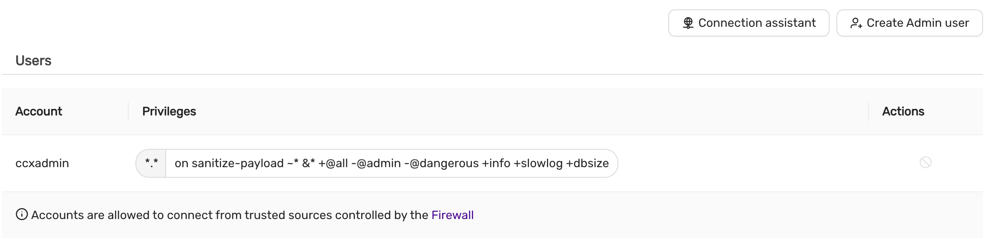
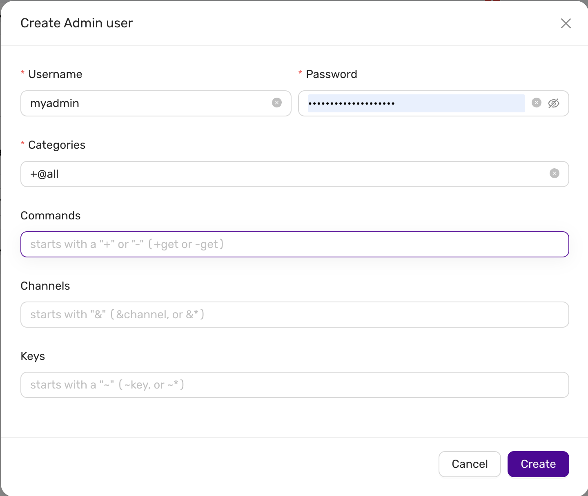

# User Management

CCX simplifies Valkey user management by providing a clear and intuitive user interface for managing privileges and accounts. Below are detailed instructions and explanations for managing Valkey users within the CCX environment.

## Viewing Existing Users

To view existing Valkey users:

1. Navigate to the **Users** section in your CCX Valkey cluster.
2. Here you'll see a list of existing user accounts along with their associated privileges.

### User Information Displayed:
- **Account:** Username of the Valkey user.
- **Privileges:** Specific privileges granted or filtered out.
- **Actions:** Options to manage (modify/delete) the user.

> **Note:** By default, the `-@admin` and `-@dangerous` privileges are filtered out for security purposes.

## Creating a New Valkey Admin User

To create a new Valkey admin user:

1. Click on the **Create Admin user** button.
2. Fill in the required fields:

   - **Username:** Enter the desired username.
   - **Password:** Enter a secure password for the user.
   - **Categories:** Enter the privilege categories. By default, using `+@all` will grant all privileges except those explicitly filtered (like `-@admin` and `-@dangerous`).

3. Optionally, you can define more granular restrictions:

   - **Commands:** Enter commands to explicitly allow (`+`) or disallow (`-`). For example:
     - Allow command: `+get`
     - Disallow command: `-get`

   - **Channels:** Specify Valkey Pub/Sub channels. You can allow (`&channel`) or disallow (`-&channel`).

   - **Keys:** Specify key access patterns. Use the syntax `~key` to allow or `~-key` to disallow access to specific keys or patterns.

4. After completing the form, click on the **Create** button to save the new user.

## Default Privilege Filtering

CCX ensures the security of your Valkey instance by automatically filtering potentially harmful privileges:

- **`-@admin`:** Restricts administrative commands.
- **`-@dangerous`:** Restricts commands that could compromise the cluster's stability.

These privileges cannot be granted through CCX's standard user interface for security reasons.

## Firewall and Access Control

User accounts in CCX Valkey clusters are protected by built-in firewall rules:

- **Accounts** are only allowed to connect from trusted sources defined in the firewall settings.

Ensure your firewall rules are properly configured to maintain secure access control to your Valkey users.